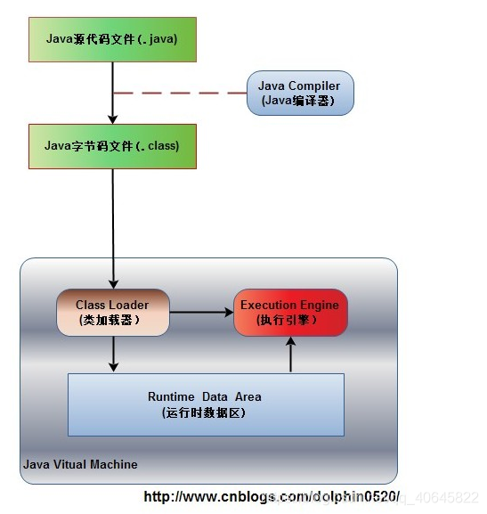
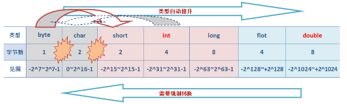
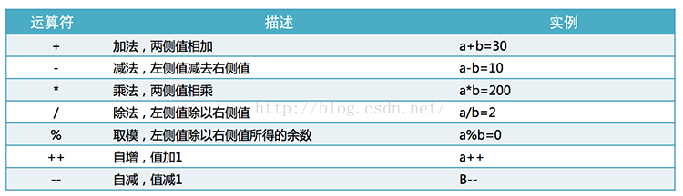
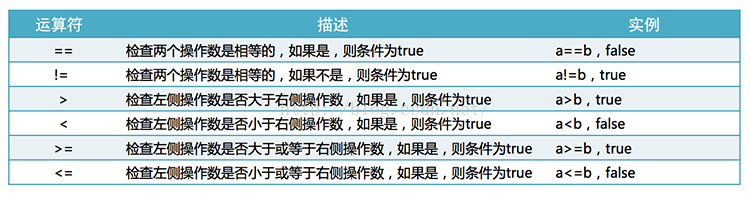
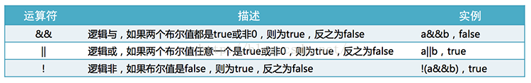
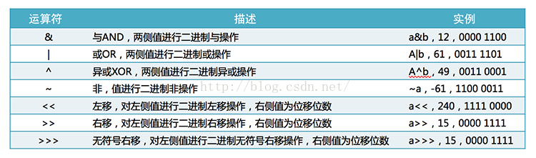

# 前奏

## java的运行机制
### 运行一个Java程序的步骤

1、编辑源代码xxx.java
2、编译xxx.java文件生成字节码文件xxx.class
3、JVM中的类加载器加载字节码文件
4、JVM中的执行引擎找到入口方法main()，执行其中的方法



## JDK、JRE、JVM区别与联系

JDK是 Java 语言的软件开发工具包(SDK)。在JDK的安装目录下有一个jre目录，里面有两个文件夹bin和lib，在这里可以认为bin里的就是jvm，lib中则是jvm工作所需要的类库，而jvm和 lib合起来就称为jre。

### jdk

> JDK(Java Development Kit) 是整个JAVA的核心，包括了Java运行环境（Java Runtime Envirnment），一堆Java工具（javac/java/jdb等）和Java基础的类库（即Java API 包括rt.jar）。
> JDK是java开发工具包，基本上每个学java的人都会先在机器 上装一个JDK，那他都包含哪几部分呢？在目录下面有 六个文件夹、一个src类库源码压缩包、和其他几个声明文件。其中，真正在运行java时起作用的 是以下四个文件夹：bin、include、lib、 jre。有这样一个关系，JDK包含JRE，而JRE包 含JVM。

### JRE

> JRE（Java Runtime Environment，Java运行环境），包含JVM标准实现及Java核心类库。JRE是Java运行环境，并不是一个开发环境，所以没有包含任何开发工具（如编译器和调试器）
> JRE是指java运行环境。光有JVM还不能成class的 执行，因为在解释class的时候JVM需要调用解释所需要的类库lib。 （jre里有运行.class的java.exe）
> JRE （ Java Runtime Environment ），是运行 Java 程序必不可少的（除非用其他一些编译环境编译成.exe可执行文件……），JRE的 地位就象一台PC机一样，我们写好的Win64应用程序需要操作系统帮 我们运行，同样的，我们编写的Java程序也必须要JRE才能运行。

### JVM

> JVM（Java Virtual Machine），即java虚拟机, java运行时的环境，JVM是一种用于计算设备的规范，它是一个虚构出来的计算机，是通过在实际的计算机上仿真模拟各种计算机功能来实现的。针对java用户，也就是拥有可运行的.class文件包（jar或者war）的用户。里面主要包含了jvm和java运行时基本类库（rt.jar）。rt.jar可以简单粗暴地理解为：它就是java源码编译成的jar包。Java虚拟机在执行字节码时，把字节码解释成具体平台上的机器指令执行。这就是Java的能够“一次编译，到处运行”的原因。
>
> 包含栈内存、堆内存、方法区内存

### JDK、JRE、JVM三者联系

> JVM不能单独搞定class的执行，解释class的时候JVM需要调用解释所需要的类库lib。在JDK下面的的jre目录里面有两个文件夹bin和lib,在这里可以认为bin里的就是jvm，lib中则是jvm工作所需要的类库，而jvm和 lib和起来就称为jre。JVM+Lib=JRE。总体来说就是，我们利用JDK（调用JAVA API）开发了属于我们自己的JAVA程序后，通过JDK中的编译程序（javac）将我们的文本java文件编译成JAVA字节码，在JRE上运行这些JAVA字节码，JVM解析这些字节码，映射到CPU指令集或OS的系统调用。

### JDK、JRE、JVM三者区别

> a.JDK和JRE区别：在bin文件夹下会发现，JDK有javac.exe而JRE里面没有，javac指令是用来将java文件编译成class文件的，这是开发者需要的，而用户（只需要运行的人）是不需要的。JDK还有jar.exe, javadoc.exe等等用于开发的可执行指令文件。这也证实了一个是开发环境，一个是运行环境。
> b.JRE和JVM区别：JVM并不代表就可以执行class了，JVM执行.class还需要JRE下的lib类库的支持，尤其是rt.jar。

### jvm和jrm

jre = jvm + 各种基础类库 + java类库（比如String/System类）


### path
告诉操作系统去哪里找命令
`%JAVA_HOME%/bin` 其中`JAVA_HOME`指已有的`JAVA_HOME`所配置的路径


### 验证jdk命令
javac -version
```powershell
javac 1.8.0_271
```
### 验证jre命令
java -version
```powershell
java version "1.8.0_271"
Java(TM) SE Runtime Environment (build 1.8.0_271-b09)
Java HotSpot(TM) 64-Bit Server VM (build 25.271-b09, mixed mode)
```
### CLASSPATH
告诉jre去哪里找class文件，如果不配置，默认去当前目录中查找


### java程序的基本结构
源程序以`.java`结尾
类：class，在同一个类中`public`修饰的类只能有一个，称为主类
主类类名必须与文件名相同


### 编译命令
javac -d <目录> 源文件

- 其中-d指定生成“字节码文件”放到指定位置
- 源文件中有几个类就生成几个`.class`文件


### 编码问题
`javac -encoding utf-8  -d . className`

### JDK目录

JDK/bin目录下有javac.exe和java.exe

> javac.exe：负责编译
>
> java.exe：负责运行

# 规范

## 标识符

> 类名
>
> 方法名
>
> 接口名
>
> 常量名

## 标识符命名规范

构成：数字、字母、$ 、_ 

> 不能以数字开头
>
> 严格区分大小写
>
> 非关键字
>
> 见名知意
>
> 多个单词使用CamelCase驼峰命名法
>
> 类名、接口名：首字母大写，后面每个单词首字母大写
>
> 常量名、方法名：首字母小写，后面单词首字母大写
>
> 常量名：全部大写

## 关键字和保留字

| 类别                 | 关键字       | 说明                         |
| -------------------- | ------------ | ---------------------------- |
| 访问控制             | private      | 私有的，只能在本类中使用     |
| –                    | protected    | 受保护的，同包下，子类可访问 |
| –                    | 缺省         | 同包下可访问                 |
| –                    | public       | 公共的，所有地方都可以访问   |
| 类、方法和变量修饰符 | abstract     | 声明抽象                     |
| –                    | class        | 类                           |
| –                    | extends      | 扩充/继承                    |
| –                    | final        | 最终值，不可改变的           |
| –                    | implements   | 实现（接口）                 |
| –                    | interface    | 接口                         |
| –                    | native       | 本地，原生方法（非Java实现） |
| –                    | new          | 新，创建                     |
| –                    | static       | 静态                         |
| –                    | strictfp     | 严格，精准                   |
| –                    | synchronized | 线程，同步                   |
| –                    | transient    | 短暂                         |
| –                    | volatile     | 易失                         |
| 基本类型             | boolean      | 布尔型                       |
| –                    | byte         | 字节型                       |
| –                    | char         | 字符型                       |
| –                    | double       | 双精度浮点                   |
| –                    | float        | 单精度浮点                   |
| –                    | int          | 整型                         |
| –                    | long         | 长整型                       |
| –                    | short        | 短整型                       |
| 程序控制语句         | break        | 跳出循环                     |
| –                    | case         | 定义一个值以供switch选择     |
| –                    | continue     | 继续                         |
| –                    | default      | 默认                         |
| –                    | do           | 运行                         |
| –                    | else         | 否则                         |
| –                    | for          | 循环                         |
| –                    | if           | 如果                         |
| –                    | instanceof   | 实例                         |
| –                    | return       | 返回                         |
| –                    | switch       | 根据值选择执行               |
| –                    | while        | 循环                         |
| 变量引用             | super        | 父类，超类                   |
| –                    | this         | 本类                         |
| –                    | void         | 无返回值                     |
| 包相关               | import       | 引入                         |
| –                    | package      | 包                           |
| 错误处理             | assert       | 断言表达式是否为真           |
| –                    | catch        | 捕捉异常                     |
| –                    | finally      | 有没有异常都执行             |
| –                    | throw        | 抛出一个异常对象             |
| –                    | throws       | 声明一个异常可能被抛出       |
| –                    | try          | 捕获异常                     |
| 保留关键字           | goto         | 是关键字但不能使用           |
| –                    | const        | 是关键字但不能使用           |
| –                    | null         | 空                           |


# 变量

## 字面值（=后面的）

| **数据类型**           | **默认值** |
| :--------------------- | :--------- |
| byte                   | 0          |
| short                  | 0          |
| int                    | 0          |
| long                   | 0L         |
| float                  | 0.0f       |
| double                 | 0.0d       |
| char                   | 'u0000'    |
| String (or any object) | null       |
| boolean                | false      |

| 基本类型            | 所占字节 | 最大值和最小值（二进制） | 最大值和最小值（十进制）                  |
| ------------------- | -------- | ------------------------ | ----------------------------------------- |
| byte（数值类型）    | 1        | -2^7到2^7 -1             | -128到127                                 |
| short（数值类型）   | 2        | -2^15到2^15 -1           | -32768到32767                             |
| int（数值类型）     | 4        | -2^31到2^31-1            | -2147483648到2147483647                   |
| long（数值类型）    | 8        | -2^63到2^63 -1           | -9223372036854775808到9223372036854775807 |
| float（浮点类型）   | 4        | 单精度                   |                                           |
| double（浮点类型）  | 8        | 双精度                   |                                           |
| char（字符类型）    | 2        | 0到2^16-1                | 0到65535                                  |
| boolean（布尔类型） | 1        | true或者false            |                                           |

**使用例子**

long型: long i = 10L;(l或L结尾)

int型: int i = 10; (int为默认类型)

16进制hex型: int hexVal = 0x2f;

8进制ox型: int oxVal = 012;

2进制bin型: int binVal = 0b10110;

float型(f或F结尾)

double型：以d或D结尾，默认类型，可以不写

浮点型科学计数法: e或E表示，e2为10的二次方(即100)，1.2e2为1.2*100

字符: 单引号

字符串: 双引号

转义字符: 以\表示, \r(回车), \n(换行), \t(制表)

## 数据类型转换

大范围转小范围进度损失，需要强制转型

小范围转大范围自动转型

```java
byte a = 128  // 可以
byte b = 129  // 超过范围
byte b = (byte)129  // 强制转换，值超出
```




# 运算符

## 算术运算符

算术运算符用于在数学表达式中，他们是在代数中使用的方法相同。假设整型变量a=20，b=10，则：



++在变量前：先进行自加1，在赋值，--，同理

```java
int a = 10;
int b = ++ a  // b = 11, a =11
```

++在变量后：先赋值，在进行自加1，--，同理

```java
int a = 10;
int b =  a ++ // b = 10, a=11
```

+=等同于：a = (强制类型转换)(a+b)，不等同于a = a + b

```java
byte a = 10;
a = a + 10  // 错误
a += 10 // 正确  等同于a = （byte）(a+10)
```

+如果两侧都是数字，执行求和，如果有一个是字符串，那么执行拼接，结果也是字符串

```java
int a = 10;
int b = 20;
System.out.println(a+b);  // 30
System.out.println(a+b+"30");  // 3030
System.out.println("10+20="+(a+b));  // 10+20=30
System.out.println(a+"+"+b+"="+(a+b)); // 10+20=30,动态的
```

## 关系运算符

关系运算符用来比较操作数，结果一定是布尔类型，比较的是变量中的值，不是内存地址，假设变量a=20，b=10，则：




## 逻辑运算符

逻辑运算符用来描述与、或、非逻辑关系，假设变量a=true，b=false，则：



>  &&为取假运算，从左到右依次判断，如果遇到一个假值，就返回假值，以后不再执行，否则返回最后一个真值；
>
>  || 为取真运算，从左到右依次判断，如果遇到一个真值，就返回真值，以后不再执行，否则返回最后一个假值。

## 位运算符

位运算符可以应用到整数类型，长型，整型，短整型，字符和字节。它作用于位，并执行逐位操作。二进制位操作具体看：[二进制是怎样做位运算的](http://blog.csdn.net/ooppookid/article/details/51009508)
假设整型变量A=60（0011 1100）和变量B=13（0000 1101），则：



## 赋值运算符

赋值运算符是为变量赋值所使用，如下：


## 其它运算符_三元运算符

条件运算符也被称为三元运算符，可以作为赋值运算符种很特殊的一种，此运算符是确定哪些值应分配给变量。语法：

```java
value n = 布尔表达式
		？表达式1
		：表达式2
```

布尔表达式为true，选择表达式1作为整个表达式的执行结果，布尔表达式为false时，选择表达式2作为整个表达式的执行结果

"?"号左侧为条件表达式ture或false，如果true则将":"左侧值赋值给"="左侧的变量；如果false则将":"右侧值赋值给"="左侧的变量。

## 短路与和逻辑与

```java
// 逻辑与
int a = 1;
int b = 3;
System.out.println(a > b & ++a >2);   //false
System.out.println(a);  // a = 2,后续的代码被执行了


// 短路与
int a = 1;
int b = 3;
System.out.println(a > b && ++a >2);   //false
System.out.println(a);  // a = 1，后续的代码没有执行
```

# 控制语句

## 选择结构

### if ,if else语句

```java
if(布尔表达式) {
    // 表达式为true执行
}


///////////
if(布尔表达式) {
    // 表达式为true执行
}else {
    // 表达式为false执行
}


///////////
if(布尔表达式) {
    // 表达式为true执行
}else if(布尔表达式) {
    // 表达式为true执行
}else{
    // 表达式为false执行
}
```

## 流程控制

### switch

```java
switch(byte|short|int|String|Enum){
     case value :
       //语句
       break; //可选
    case value :
       //语句
       break; //可选
    //你可以有任意数量的case语句
    default : //可选
       //语句
}
```
## 循环语句

### for循环

初始化变量可以多个，三个值可以省略不写，但是分号必须保留

```java
for(初始化; 布尔表达式; 更新) {
    //代码语句
}

// 例子
public class forxunhuan {
    public static void main(String[] args) {
        for(int x = 10; x < 20; x++) {
            System.out.print("value of x : " + x );
            System.out.print("\n");
        }
    }
}


```

```java
// continue
public class forxunhuan {
    public static void main(String[] args) {
        for(int x = 10; x < 20; x++) {
            if (x == 15 ){
                continue;   //  x == 15的时候不再执行后续代码，进入下一次循环
            }
            System.out.print("value of x : " + x );
            System.out.print("\n");
        }
    }
}

// result
value of x : 10
value of x : 11
value of x : 12
value of x : 13
value of x : 14
value of x : 16
value of x : 17
value of x : 18
value of x : 19
```

```java
// break
public class forxunhuan {
    public static void main(String[] args) {
        for(int x = 10; x < 20; x++) {
            if (x == 15 ){
                break;   //  x == 15的时候不再执行后续代码，进入下一次循环
            }
            System.out.print("value of x : " + x );
            System.out.print("\n");
        }
    }
}

//result
value of x : 10
value of x : 11
value of x : 12
value of x : 13
value of x : 14
```

计算质素

```java
public class forxunhuan {
    public static void main(String[] args) {
        int count = 0; // 统计
        for (int i = 2; i<=100; i++){
            boolean isSuShu = true;  // 标记
            for (int j = 2; j<i; j++){
                if (i%j==0){
                    isSuShu = false;
                    break;
                }
            }

            if (isSuShu){
                count++;
                System.out.println(i);
            }
        }
        System.out.println("共有："+count + "个质素");
    }
}
```

### while循环

```java
while(布尔表达式){
    //java语句；
}

//例子
public class whilexunhuan {
    public static void main(String[] args) {
        int a = 1;
        while (a<10){
            System.out.println("while执行");
            a++;
            System.out.println(a);
        }
    }
}
```

### do……while循环

```java
do {
       //代码语句
}while(布尔表达式);

// 例子
public class dowhile {
    public static void main(String[] args) {
        int a =0;
        do{
            System.out.println(a);
            a++;
        }while (a<10);
    }
    
//result
1
2
3
4
5
6
7
8
9
```

# 面向对象基础

## java传参机制

只是值传递，传递的是副本，不会改变值本身
传递参数是基本数据类型，原始的数据不会改变
传递参数是引用类型，原始的值不会改变，但是内存地址对应的内容会发生改变

```java
package com.minsusu;


/**
 * 函数的参数
 *  1、基本类型
 *  2、引用类型
 */
public class FunctionTest {
    public static void main(String[] args){
        // 传递参数是基本数据类型，原始的数据不会改变
        int a = 3;
        int b = 4;
        exchange(a,b);
        System.out.println("a的值:"+a);  // a的值:3
        System.out.println("b的值:"+b);  // b的值:4

        // 传递参数是引用类型，原始的值不会改变，但是内存地址对应的内容会发生改变
        Person person =new Person();
        person.name = "马云";
        exchange(person);
        System.out.println(person.name);  //内容发生改变=>王健林
        System.out.println(person);  //  地址值不会改变Person@1b6d3586
    }

    /**
     * 交换两个数字的位置
     * @param a  第一个数字
     * @param b  第二个数字
     */
    public static void exchange(int a, int b){
        int tmp = a;
        a = b;
        b = tmp;

    }


    public static void exchange(Person person){
        person.name = "王健林";
        person = null;
    }
}


class Person {
    String name;
}
```

## java中的变量

成员变量（在类中定义）：分为类变量（有static）和实例变量（没有static）

- 不需要初始化，系统默认有初始值，数值型初始化0，布尔型初始化为false，引用型初始化为null
```java
package com.minsusu;

public class Variable2 {
    int a;  // 实例变量
    static int b;  // 类变量
    public static void main(String[] args) {
        // 访问实例变量
        Variable2 v = new Variable2();
        System.out.println("实例变量a:"+v.a);  // 实例变量a:0


        // 访问类变量
        System.out.println("类变量b:"+b);  // 类变量b:0

    }
}
```
局部变量（在方法中定义）：形式参数，普通变量，代码块中的局部变量

- 必须显示的指定为初始值，然后才能使用，否则编译报错
```java
package com.minsusu;

public class variable {
    public static void main(String[] args) {
        int a ;  // 局部变量,必须指定初始值，才能使用
        System.out.println(a);
    }
}


out
java: 可能尚未初始化变量a
```
### 局部变量、成员变量、类变量

静态变量：由static修饰的变量为静态变量 本质为全局变量
成员变量、类变量区别：
1、成员变量随着对象创建存在 对象回收而释放
2、静态变量随着类加载而存在 类消失而消失

3、成员变量只能被对象调用
4、静态变量可以被对象和类调用

5、成员变量也称实例变量、数据存储在堆内存的对象中 称对象的特有数据
6、静态变量也称类变量、数据存储在方法区 称对象的共享数据

7、类变量声明在类中、方法体之外 但必须声明为static类型
8、静态方法不能使用`this `因为`this`代表对象

局部变量：在方法、构造方法、语句块中定义的变量。其声明和初始化在方法中实现，在方法结束后自动销毁

```java
public class  ClassName{
    public void printNumber(){
        int a;  // 局部变量
    }
    // 其他代码
}
```

成员变量：定义在类中，方法体之外。变量在创建对象时实例化。成员变量可被类中的方法、构造方法以及特定类的语句块访问。

```java
public class  ClassName{
    int a;
    public void printNumber(){
        // 其他代码
    }
}
```

类变量：定义在类中，方法体之外，但必须要有 static 来声明变量类型。静态成员属于整个类，可通过对象名或类名来调用。

```java
public class  ClassName{
    static int a;
    public void printNumber(){
        // 其他代码
    }
}
```

### 成员变量与局部变量的区别

#### 声明位置不同

成员变量也就是属性，在类中声明的。
局部变量，在方法中声明或代码块中声明。

#### 初始值不同

成员变量如果没有赋值则是有默认值的，数据类型不同则默认值不同。
局部变量是没有默认值，也就是说必须先声明，再赋值，最后才使用。

#### 在一个类中不同

局部变量可以与成员变量同名，但是局部变量优先,如果非要访问成员变量的属性，则必须使用 `this.color`
`this` 代表当前这个对象，也就是当前谁调用这个方法则这个对象就是谁。
对象与引用的区别
对象是具体的一个实例，如：`new Student(); new `表示创建一个对象，并在堆内存中开辟一块空间。
用名称是存放的对象的地址。

## java三四五

三种类型：类、接口、枚举
四个修饰符：`private|protected|public`、`final`、`static`、`abstract`
五大成员：成员变量、方法、构造器  、初始化代码块、内部类
## java修饰符
| **修饰符** | **顶层类/接口** | **成员属性** | **方法** | **构造器** | **初始化块** | **成员内部类** | **局部成员** | **备注** |
| :---: | :---: | :---: | :---: | :---: | :---: | :---: | :---: | :---: |
| public | √ | √ | √ | √ |  | √ |  |  |
| protected |  | √ | √ | √ |  | √ |  |  |
| 包访问控制符 | √ | √ | √ | √ | ○ | √ | ○ |  |
| private |  | √ | √ | √ |  | √ |  |  |
| abstract | √ |  | √ |  |  | √ |  |  |
| final | √ | √ | √ |  |  | √ | √ |  |
| static |  | √ | √ |  | √ | √ |  |  |
| strictfp | √ |  | √ |  |  | √ |  | 严格浮点数 |
| synchronized |  |  | √ |  |  |  |  | 线程同步 |
| native |  |  | √ |  |  |  |  | 原生C/C++ |
| transient |  | √ |  |  |  |  |  | 序列化 |
| volatile |  | √   |  |  |  |  |  | 线程同步，让其他线程立即知道修改 |

# 面向对象

**面向过程**：面向过程，你得先分析出解决问题的步骤，然后用函数把这些步骤一步一步地实现，解决的时候就是一个一个函数地调用，都是以因果关系构成，只要其中的因果关系断裂，导致整个程序奔溃

优点：性能比面向对象高，因为类调用时需要实例化，开销比较大，比较消耗资源;比如单片机、嵌入式开发、 Linux/Unix等一般采用面向过程开发，性能是最重要的因素。
缺点：没有面向对象易维护、易复用、易扩展，耦合度高

洗衣机例子：

> 1 执行加洗衣粉方法；
>
> 2.执行放洗涤剂方法
>
> 3.执行加水方法；
>
> 4.执行放衣服，洗衣服方法；
>
> 5.执行清洗方法；
>
> 6.执行烘干方法；

**面向对象**：类中某个具体的实例，独立体（比如独立显卡），比如人类张三，李四就是类的某个对象，他们有自己独特的个性。

优点：易维护、易复用、易扩展，由于面向对象有封装、继承、多态性的特性，可以设计出低耦合的系统，使系统 更加灵活、更加易于维护
缺点：性能比面向过程低

洗衣机例子：

> 我先搞个洗衣机对象和人对象 
>
> 洗衣机： 加入一些属性和方法 洗衣服方法 清洗方法 烘干方法    
>
> 人：加洗衣粉方法 加水方法 
>
> 然后 人.加洗衣粉 人.加水  洗衣机.洗衣服 洗衣机.清洗 洗衣机.烘干

## 面向对象三个特点

封装性

继承性

多态性

在整个生命周期中包含

> 面向对象发行：OOA
>
> 面向对象设计：OOD
>
> 面向对象编程：OOP

## 类Class

代表代表一类具有共同特征的事物，比如汽车设计图

类所描述的是多个对象的共同特征（属性），例如身高，年龄

同时类也有共同的动作（函数or方法）

要访问类内部特征需要创建对象

类的定义:一个类文件中`public class`只能有一个

## 定义类

```java
[修饰符] class 类名{
    // 成员变量
    // 方法
    // 构造器 
    // 初始化代码块
    // 内部类
}
```
类的修饰符：有且仅有`public`、`final`(或者`abstract`)。`final`和`abstract`互斥，只能有一个；
类名首字母大写，多个单词第一个字母大写
## 定义成员变量

称为 `field`字段

```java
[修饰符] 类型 变量名 [= 初始值] 
```
可用修饰符：可选，`private|protected|public`、`final`、`static`和`transient`(序列化相关)

类型：8中基本数据类型、引用数据类型

变量名：可选，驼峰写法，首字母小写、后面每个单词大写

成员变量不用显式初始化,只要定义了一个类属性或实例属性,系统默认进行初始化

## 定义方法

成为`method`

修饰符 `public,protected,private,static,final,abstract`,其中访问控制符只能出现一个,`abstract ,final `只能出现其一

```java
[修饰符] 返回值类型 方法名（形参列表）{
	// 各种语句。定义变量、流程控制、赋值语句输出语句
}
```
能够完成独立功能的重复利用的代码段

定义在类体中，没有先后顺序（原因java是先编译在执行）

方法体中不能在定义方法

方法体中的代码是自上而下执行

方法不被调用不会分配内存【栈内存】，方法调用的时候，会给该方法执行push压栈动作，调用完毕后执行pop弹栈动作，释放空间

方法要么属于一个类,要么属于一个对象

static 是一个特殊的关键字,译为”静态”,所有有static 修饰的叫类属性,类方法,类成员

形式参数：如果在定义方法时,在最后一个参数的类型后增加三点`…`，则表明该形参接受多个参数值,多个参数值被当成数组传入；长度可变的形参只能位于最后一个参数，并一个方法里只能有一个可变长度的参数。

#### 返回值类型

定义返回值类型为`void`，则方法内部不能有任何返回值，但是`return`需要写，虽然可以省略，但是一般都写上，（mian函数中除外），同理在定义没有返回值的函数是，必须写`void`

定义返回值类型，与方法内部的返回值必须相同，否则编译报错

返回类型：byte,short,int,long,falot,double,true,false,void

- 基本数据类型
- 引用类型

```java
 // 方法  正确的
    public static int getSum(int a, int b){
        return  a+b;
    }

 // 方法  错误的 方法定义返回类型是int,但是返回的是Boolean类型
    public static int getSum(int a, int b){
        return  true;
    }
```

#### 方法的调用

static修饰的类方法：类名.方法名，当前类中的调用可以省略类名

非static修饰的实例方法：实例.方法名，在类中使用`this.方法名`，`this`可以省略

#### 方法重载overload

**使用方法重载**，相似的功能的函数名称相同，调用函数名称相同，根据传入的列表不同自动调动对应的方法，返回值类型无关

口诀：

> 一同：函数名称相同
>
> 两不同：形式参数列表不同，此处不同体现为参数类型、参数个数

不需要记忆更多的方法名，更加美观

```java
public class overLoad {
//    使用方法重载,方法名相同，参数类型或者数量不同
public static void main(String[] args) {
    int resInt = sum(1, 2);
    double resDouble = sum(1.0, 2.0);
    long resLong = sum(1L, 2L);
    System.out.println(resInt + "\t" + resDouble + "\t" + resLong);
    // 多个参数的
	System.out.println(sum(1,2,3));
}

    public static int sum(int a, int b) {
        return a + b;
    }

    public static double sum(double a, double b) {
        return a + b;
    }

    public static long sum(long a, long b) {
        return a + b;
    }
    
    //多个参数
    public static long sum(int a, int b, int c) {
        return a + b + c;
    }
}
```


## 定义构造器

### 构造方法特点

1、构造方法名字和类相同 没有返回值
2、不能直接调用构造方法 要通过`new`关键字来自动调用、从而创建类的实例
3、Java类必须要有构造方法 如果没有Java编译器会自动提供不带参数的构造方法
4、New关键字的作用：为对象分配内存空间 引起对象构造方法的调用 
5、使用java类实例化一个对象的时候，如果在类中不显式的声明其构造函数，则会使用一个默认的构造函数来初始化对象。

### 格式

> 构造方法名和类名保持一致
>
> 构造方法：又称构造函数、初始化方法、构造器、Constructor
>
> 修饰符：可以是`public protected private `构造器必须和类名相同,形参和方法的形参一样.

### 语法

```java
[修饰符] 类名（形参列表）{
	// 各种语句。定义变量、流程控制、赋值语句输出语句
    // 没有返回值
}

// 生成Student类的构造方法（构造函数、初始化方法、构造器）
public Student(String name, int age, double height) {
          this.name = name;
          this.age = age;
          this.height = height;
     }
```
### 构造方法重载

```java
package com.minsusu.面向对象03.构造方法重载;

public class Student {
    private String name;
    private int age = 18;
    private double height;

    // 手动创建缺省构造器
    public Student() {

    }
    // 一个参数的构造器，可以用于方法重载，可以使用默认值
    public Student(String name) {
        this.name = name;
    }
    // 一个参数的构造器，可以用于方法重载，可以使用默认值
    public Student(int age) {
        this.age = age;
    }
    

    // 一个参数的构造器，可以用于方法重载，可以使用默认值
    public Student(double height) {
        this.height = height;
    }
    // 两个参数的构造器，可以用于方法重载，可以使用默认值
    public Student(String name, double height) {
        this.name = name;
        this.height = height;
    }
	// 三个参数的构造器，可以用于方法重载
    public Student(String name, int age, double height) {
        this.name = name;
        this.age = age;
        this.height = height;
    }
	
    // Getter和Setter
    public String getName() {
          return name;
     }

     public void setName(String name) {
          this.name = name;
     }

     public int getAge() {
          return age;
     }

     public void setAge(int age) {
          this.age = age;
     }

     public double getHeight() {
          return height;
     }

     public void setHeight(double height) {
          this.height = height;
     }
}
```

```java
package com.minsusu.面向对象03.构造方法重载;

public class User {
    public static void main(String[] args) {
        Student s = new Student("王小二", 18, 1.65);
        System.out.println(s.getAge());
        System.out.println(s.getName());
        System.out.println(s.getHeight());
        Student s1 = new Student("王小二", 1.65);
        System.out.println(s1.getAge());
        System.out.println(s1.getName());
        System.out.println(s1.getHeight());

    }
}
```

## this关键字

类中带有static的方法（静态方法）中没有this

类中不带static的方法（实例方法），this指向当前对象

实例方法可以直接方法类成员变量和类成员方法

this（参数）：通过本类中调用本类中另一种形式的构造函数（应该为构造函数中的第一条语句）。

```java
package com.minsusu.面向对象06.this的使用;


public class User {
    String name = "java";  // 实例属性
    static String _name;  // 类属性
    public static void main(String[] args) {
        // 访问静态方法
        User._sum();

        // 访问实例方法
        User u = new User();
        u.sum();
    }
    /**
     * static修饰的方法中没有this
     */
    public static void _sum(){
       // this.name;  // 错误的
       // name;  // 错误
       //  如果要访问实例变量需要new
        User u = new User();
        System.out.println("这是静态方法中访问实例属性"+u.name);
    }
	
     /**
     * 没有static修饰的实例方法
     */
    public void sum(){
        String names = this.name;
        // or
        // String names = name;
        System.out.println("这是在实例方法中访问实例属性"+names);
    }

}
```

## super关键字

`super`关键字能够出现在实例方法和构造方法中

`super`不能出现在static静态方法中

`super.`大部分情况下可以省略

`super.` 什么情况下不可省略：

`super()`只能出现在构造方法的第一行，通过当前的构造方法调用父类的构造放过，实现代码复用

`super（参数）`：调用父类中的某一个构造函数（应该为构造函数中的第一条语句）。

`super()`和`this()`，只能有一个，没有`this()`，系统会默认调用`super()`

`super()`默认先执行父类的构造方法，无论什么情况父类的构造方法一定会执行

### super的语法

```java
super();
super(参数); // 调用某一个有参数的构造方法
// or
super.
```

例子

```java
package com.minsusu.面向对象13.super关键字;


public class SuperTest {
    public static void main(String[] args) {
        new B();
    }
}


class A {
    // 建议写上无参构造，防止子类继承时候默认调用super()，无参数构造方法
    public A() {
        System.out.println("A的无参数构造方法");
    }

    public A(int a) {
        System.out.println("A的有参数构造方法");
    }
}


class B extends A {
    public B() {
        // super(); // 默认的
        // super(1);  // 调用父类中的有参数的构造器
        this("周杰伦");  // 调用本类中的另一个构造器
        System.out.println("B的无参数构造方法");
    }


    public B(String s) {
        System.out.println("B的有参数构造方法");
    }
}
```

## java封装

- 隐藏：隐藏的内部实现细节
- 暴露：将一些操作界面暴露出来，通过暴露出来的界面操作对象，不会破坏对象内部

要求：合理的隐藏、合理的暴露
### 访问控制符
| **权限** | **private** | **缺省** | **protected** | **public** |
| :---: | :---: | :---: | :---: | :---: |
| 当前类 | √ | √ | √ | √ |
| 同一个包 | × | √ | √ | √ |
| 子类 | × | × | √ | √ |
| 任意 | × | × | × | √ |

### 使用原则

- 成员变量（实例变量）：通常使用private修饰，为了隐藏细节
- 为成员变量提供对应的public修饰的getXxx方法个setXxx方法，给外部对数据进行控制
- 需要暴露的方法，通常使用public修饰
- 如果一个方法希望被子类重写，一般用protected修饰

### 封装优点

① 类的成员变量可以成为只读或者只写的。

② 类可以对储存在其中的成员变量中的内容有一个整体的控制。

③类的用户不需要知道类是如何储存数据的。

### Getter和Setter方法

注意：需不要static修饰

```java
package com.minsusu.面向对象01;

public class Student {
    private String name;
    private int age;
    private double height;

     public String getName() {
          return name;
     }

     public void setName(String name) {
          this.name = name;
     }

     public int getAge() {
          return age;
     }

     public void setAge(int age) {
          this.age = age;
     }

     public double getHeight() {
          return height;
     }

     public void setHeight(double height) {
          this.height = height;
     }
}
```

### 调用Getter或Setter

```java
package com.minsusu.面向对象01;

public class User {
    public static void main(String[] args) {
        Student s = new Student();
        // Setter方法
        s.setAge(18);
        s.setName("张三丰");
        s.setHeight(1.80);
        // Getter方法
        System.out.println(s.getAge());
        System.out.println(s.getName());
        System.out.println(s.getHeight());
    }
}
```

## 

## java继承
java单继承；
如果没有写父类，默认继续Object类；
继承的作用，实现代码的复用

```java
[修饰符] class 类名 extends父类{
}
```
### 常见术语

B继承A类：

> A类：称为父类，基类，超类，superclass
>
> B类：称为子类、派生类subclass

### 限制

> 私有的属性和方法不支持继承
>
> 构造方法不支持继承
>
> 其他数据都可以继承

### 重写override

父类的方法无法满足子类需要重写，子类在调用重写方法时调用重写后的方法
重写的口诀

- 2同：方法名相同，参数列表相同
- 2小：返回值类型相同或更小，声明抛出的异常相同或更小
- 1大：访问权限相同或更大


在重写的方法上方加上`@override` ，报错时会提醒：`方法不会覆盖或实现超类型的方法`

#### 重载与重写的区别

重载：发生在同一个类中

重写:在继承关系中

### super限定

限定父类的定义的实例变量或者实例方法

- super.父类定义的实例变量
- super.父类定义的实例方法（参数）
### 子类构造器调用父类构造器
子类构造器一定调用父类的构造器一次，有且仅有一次
父类如果写了带参数的构造器，那么必须写上无参数构造器

- 子类没有显示的调用父类的构造器，系统会默认调用父类的无参数构造器
- 子类构造器第一行显示的使用super调用父类的构造器

super调用一定是调用父类的构造器
this调用的是当前类的构造器
super和this不可能同时出现
**注意**：如果父类没有无参构造器，子类必须显示的调用（使用super调用）父类指定的构造器


## java多态
多态：同一个类的多个实例，在执行同一个方法，呈现出多种行为特征
向上转型：int>long    子类>父类   自动转换
向下转型：long>int    父类>子类   强制转换
   只能在父子继承关系的类中强制转换，否则会报类型转换错误异常，不兼容的类型
   如果编译类型具有继承关系，被转变量类型不是要转换的目标类型就会报类型转换异常，classcastException


变量类型

- 编译时类型：申明变量是指定的类型（编译阶段）
- 运行时类型：该变量时机所引用的类型（实际类型）


### 条件

- 要有继承；
- 要有重写；
- 父类引用指向子类对象。


### `instanceof`
只有在具有继承关系的类中才能进行判断
```java
      String str= "kfmkm";
        System.out.println(str instanceof Integer);


out：
	不兼容的类型: java.lang.String无法转换为java.lang.Integer
```
例子

```java
package com.minsusu.面向对象09.多态;

/**
 * 动物类
 */
public class Animal {
    public void go(){
        System.out.println("动物在跑");
    }
}
```

```java
package com.minsusu.面向对象09.多态;

import org.omg.CORBA.PUBLIC_MEMBER;

/**
 * 鸟类
 */
public class Brid extends Animal{
    /**
     * 重写父类方法
     */
    @Override
    public void go() {
        // super.go();
        System.out.println("鸟会飞");
    }


    public void fly(){
        System.out.println("鸟儿飞行中");
    }
}

```

```java
package com.minsusu.面向对象09.多态;


/**
 * 猫类
 */
public class Cat extends Animal {


    /**
     * 方法重写
     */
    @Override
    public void go() {
//        super.go();
        System.out.println("猫在睡觉");
    }

    public void arrest(){
        System.out.println("猫抓老鼠");
    }
}
```

```java
package com.minsusu.面向对象09.多态;

import com.minsusu.面向对象07.继承.B;

public class Test {
    public static void main(String[] args) {
        // 过去的写法
        Cat c  = new Cat();
        c.go();       // 猫在睡觉
        c.arrest();   // 猫抓老鼠

        Brid b = new Brid();
        b.go();  // 鸟会飞

        Animal a = new Animal();
        a.go(); // 动物在跑
        System.out.println("***************************");
        /*
         *  1、cat与animal是继承关系，cat是子类，animal是父类
         *  2、cat类型转为animal属于向上转型upcasting
         *  3、java中允许父类型引用指向子类型对象
         */
        Animal s = new Cat();

        /*
         * 多态：
         *  1、程序在编译阶段：检测的变量s的类型是Animal，只有go()方法，称之为静态绑定
         *  2、程序在运行阶段：s变量指向的是一个Cat类型的对象，调用Cat中的go()方法，称之为动态绑定
         */
        s.go();


        /*
        *编译期报错，Animal类型没有arrest()方法
         */
        // s.arrest()


        /*
         * 向下转型：当子类型中的方法时是特有的，父类中没有，那么需要将Animal型转为Cat型
         * 需要添加强制类型转换符
         */
        Cat s1 = (Cat) s;
        s1.arrest();
        // or
        ((Cat) s).arrest();


        Animal s2 = new Brid();
        /**
         * 报错：java.lang.ClassCastException：类型转换异常，强制类型转换会发生异常
         * 1、编译阶段：可以通过  Animal类型变量s2指向Brid类型的引用，s2（Animal）和s3(Cat)两者之间存在继承关系
         * 2、运行阶段：无法运行，检测到s2变量指向的是Brid引用，但是Brid类型转换为Cat类型，出现报错
         * 3、向上转型一般不会出现错误
         * 4、向下转型可能出现类型转换错误的异常
         * 5、如何避免：
         *  5.1、语法格式
         *      (引用 instanceof 数据类型名)=>Boolean
         */
         // Cat s3 = (Cat) s2;  // 不安全的写法

         // 安全的写法
        if (s2 instanceof Cat){  // s2是一个Cat的对象？
            Cat s3 = (Cat) s2;
            s3.arrest();
        }else if (s2 instanceof Brid){  // s2是一个Brid的对象？
            Brid s3 = (Brid) s2;
            s3.fly();
        }

    }
}

```


## 初始化块


```java
[修饰符] {
	各种语句
}
```
修饰符只能有一个`static`，有`static`的称为类初始化块，无`static`的称为实例初始化块
### 类初始化块
作用：负责对类执行初始化
何时执行：当程序第一次主动使用该类时，系统会为该类分配内存空间、并执行初始化，调用类的初始化块
执行次数：只执行一次


在类变量定义时指定的初始值，是“假象”
指定的类初始值，编译之后会被还原到类初始化代码块中的一条赋值语句；
类初始化代码块和初始化类变量谁在前谁在后？
顺序以源代码中的顺序相同
```java
public class StaticInitTest {
    // 类初始化变量1
    static String name  = "王思聪";

    // 类初始化代码块
    static {
        name = "房祖名";
        name1 = "张学友";
    }

    // 类初始化变量2
    static String name1 = "刘德华";

}


/******************************编译还原后等同于*****************************************/


public class StaticInitTest {
    // 定义类变量
    static String name;
     static String name1;

    // 类初始化代码块,变量赋值语句顺序与源代码中的顺序相同
    static {
        name = "王思聪";
        name = "房祖名";
        
        name1 = "张学友";
        name1 = "刘德华";
    }

}
```


### 实例初始化块
类被编译后，实例初始化块会消失，实力初始化的所有代码会被还原到每一个构造器的开始
作用：将多个构造器开始前面部分提取到实例初始化块中
何时执行：只要程序调用构造器创建对象时，程序都会执行初始化代码块中的代码
执行次数：调用构造器时 


定义的实例变量指定的初始值，是“假象”
编译后将会还原到所有构造器代码之前


实例代码块和初始化实例变量谁在前谁在后？
由源代码中的顺序决定
```java
public class InitTest {
    // 定义实例变量,编译时会还原到构造器中的一条赋值语句
    int age1 = 30;

    // 实力初始化代码块，编译时会被还原到每一个构造器中
    {
        System.out.println("实例初始化块");
        age = 5 ;
        age1 = 10 ;
    }

    // 定义实例变量,编译时会还原到构造器中的一条赋值语句
    int age = 20;

    public InitTest(){
        System.out.println("无参数构造器");
    }


    public InitTest(String name){
        System.out.println("有参数构造器："+name);
    }
}

/*************************编译还原后等同于**************************/

public class InitTest {
   // 定义实例变量
    int age1;
    int age;

    public InitTest(){
        // 还原部分start
        age1 = 30;
        System.out.println("实例初始化块");
        age = 5 ;
        age1 = 10 ;
        age = 20;
        // 还原部分end
        System.out.println("无参数构造器");
    }


    public InitTest(String name){
       // 还原部分start
        age1 = 30;
        System.out.println("实例初始化块");
        age = 5 ;
        age1 = 10 ;
        age = 20;
        // 还原部分end
        System.out.println("有参数构造器："+name);
    }
}
```
**结论**
初始化任何类之前，一定先从Object开始初始化，依次初始化它的所有祖先类，最后才到自己类的初始化。
创建任何对象之前，一定先从Object构造器开始执行，执行它的所有祖先类的构造器，最后才到自己的构造器。


## 包装类
8种基本数据类型
int  char long byte double float  boolean short 
对应表

| **数据类型名称** | **占用字节** | **默认值** | **封装器** |
| :---: | :---: | :---: | :---: |
| byte(字节型) | 1 | 0 | Byte |
| short(短整型) | 2 | 0 | Short |
| int(整型) | 4 | 0 | Integer |
| long(长整型) | 8 | 0L | Long |
| float(浮点型) | 4 | 0.0f | Float |
| double(双精度浮点型) | 8 | 0.0 | Double |
| char(字符型) | 2 | 'u0000' | Charcte |
| boolean | 1 | false | Boolean |

**long类型如果不加L会自动转型为int，如果超出int取值范围则会报错**

### 自动装箱
基本数据类型的值可以自动当成包装类的实例使用
### 自动拆箱
包装类的实例可以当做基本类型的值使用


建议
做项目时候，通常使用包装类来申明变量，因为包装类可以当做基本数据类型使用，并且可以复赋值为null


#### 包装类.parseXxx()
不同包装类之间的转换，包装类.parseXxx()
java.lang.NumberFormatException:要转换的数字不合法，出现异常数字格式异常


#### 包装类型缓冲
```powershell
package com.minsusu;

/**
 * 包装类的缓冲
 */
public class PackageingBuffer {
    public static void main(String[] args) {
        Integer i = 20;   // -128~127范围内会有缓冲
        Integer j = 20;

        Integer k = 200;  // 不在-128~127范围内不会有缓冲
        Integer l = 200;

        System.out.println(i==j);   //true
        System.out.println(k==l);  //false
    }
}
```
### 变量类型转换
在JAVA中，基本类型(除了boolean外)可以自动转换的，转换形式为：byte,short,char – int --long–float–double这就是自动转换的顺序了，其中byte,short,char在运算时是自动转换为int型的，而int与long运算时自动转换为long型。从上可知，float与double运算时是自动转换为double再进行计算的，int与float运算时先转换为float再运算。也就是说，表述范围小的可以自动转换为表述范围大的，(表述范围不是指类型的大小)其次，如果你要得到某一类型的数值时，也可以通过强制转换来实现。

## 两个要被重写的方法
### toString()方法
程序打印对象，或者把对象转换为字符串时，实际上用的是该对象的toString方法
如果类本身没有toString方法，则会调用父类的toString方法
Object类所提供的toSting方法返回：`类名@hashCode返回值`
```java
/**
* Apple类
*/
public class Apple {
    String color;
    double weight;

    public Apple(){

    }

    public Apple(String color, double weight){
        this.color = color;
        this.weight = weight;
    }

    @Override
    public String toString(){
        return "Apple:[color="+this.color+",weight="+this.weight+"]";
    }
}


/**
* toStringOverride 类
*/

public class toStringOverride {
    public static void main(String[] args) {
        Apple apple1 = new Apple("红色",3.2);
        Apple apple2 = new Apple("白色",2.2);
        Apple apple3 = new Apple("绿色",5.0);

        System.out.println(apple1);  //Apple:[color=红色,weight=3.2]
        System.out.println(apple2);  //Apple:[color=白色,weight=2.2]
        System.out.println(apple3);  //Apple:[color=绿色,weight=5.0]
    }
}
```
对象转为String
```java
 String str = apple1 +"";  // 拼接""
 System.out.println(str);
```
### equals()方法
因为`==`是判断内存地址是否相等，equals是根据业务需要来指定两个对象相等

```java
package com.minsusu.equalsTest;

import java.util.Objects;

/**
 * 山羊类
 */
public class Goat {
    String color;
    double weight;

    public Goat(String color, double weight) {
        this.color = color;
        this.weight = weight;
    }

    /**
     * 重写equals方法
     * @param o  要比较的对象
     * @return
     */
    @Override
    public boolean equals(Object o) {
        // 比较内存地址，如果是同一个内存地址，返回true
        if (this == o) return true;
        // 如果比较的对象为空，且被比较的对象o必须是同一个类型，则返回false
        if (o == null || getClass() != o.getClass()) return false;
        // 经过上面过滤，进行强制类型转换
        Goat goat = (Goat) o;
        // 自定义的相等规则
        return this.color.equals(goat.color) && this.weight == goat.weight;
    }

    @Override
    public int hashCode() {
        return Objects.hash(color, weight);
    }

    @Override
    public String toString() {
        return "Goat{" +
                "color='" + color + '\'' +
                ", weight=" + weight +
                '}';
    }
}

```

```java
package com.minsusu.equalsTest;

public class EqualsOverride {

    public static void main(String[] args) {
        Goat goat1 = new Goat("黑色",81.0);
        Goat goat2 = new Goat("黑色",81.0);
        // 使用"==",比较内存地址
        System.out.println(goat1 == goat2 );  // false
        // 使用重写的equals方法比较
        System.out.println(goat1.equals(goat2));  //true
    }
}

```


## static修饰符

- static修饰的是类变量，没有static修饰的是成员变量
- 局部变量不属于类成员，不能使用static修饰
- static不能修饰外部类，外部类不属于任何类
- static可以修饰成员：成员变量、放过、初始化块、内部类
- static修饰构造器无任何意义，因为构造器属于实例使用
- static方法属于类方法，不能调用实例方法


### 单例模式
永远创建出的实例都是同一个
```java
package min.singleinstance;


/**
 * 单利模式
 */
public class InstanceTest {
    private static  InstanceTest s;

    /**
     * 隐藏的构造器
     */
    private InstanceTest(){}

    public static InstanceTest instance(){
        // s 为null 则创建实例
        if(s==null){
            s = new InstanceTest();
        }

        return s;
    }
}

/******************************入口*******************************/

package min.singleinstance;

public class InstanceMain {
    public static void main(String[] args) {
        InstanceTest i1 = InstanceTest.instance();
        InstanceTest i2 = InstanceTest.instance();
        System.out.println(i1 == i2); //true
    }
}
```
## final修饰符
可以修饰任何变量、方法、类
final与abstract互斥，不能同时出现
### final修饰的变量
final修饰的变量被赋值后，不能重新再赋值
final修饰的变量必须赋值，且只能赋值一次

- 非final修饰的变量，可以不指定初始值，系统默认分配
- final修饰的成员变量，必须显示指定初始值
### final修饰的**成员变量**
 final修饰的**成员变量**可以存在的三个位置，本质都是在构造器中：

- 定义时指定初始值
- 实例初始化块
- 每个构造器都需要显示的指定初始值


### final修饰的**类变量**
 final修饰的**类变量**可以存在的两个位置，本质都是在类初始化块中，实例的初始化块中能够访问final类变量，但不能修改：

- 定义时指定初始值
- 类的初始化块中


### final修饰的局部**变量**
 final修饰的**局部变量，**基本数据类型和引用类型，不能被重新赋值：

- 定义时指定初始值或者不指定初始值，但是使用时必须指定初始值
- 引用类型对象内部数据可以改变


final修饰的变量例子
```java
package min.finaltest;

/**
 * final修饰符
 */
public class FinalTest {

    // 成员变量
    final String name;
    final  int age = 18;
    final boolean sex;
    // 类变量
    final  static int number;
    final  static String fastName = "范冰冰";

    {
        name ="马化腾";
    }

    static {
        number = 125;
        // fastName = "李冰冰";  // 错误不能再赋值
    }

    public FinalTest(){
        sex = true;
    }

    public FinalTest(String li){
        sex =false;
        System.out.println(li);
        System.out.println("类的fastName"+fastName);
    }

    public void  test(){
        // sex = true;  // 不允许在成员方法中给final修饰的成员变量赋值
    }
}


/*********************************************************************/


package min.finaltest;

public class FinalMain {
    public static void main(String[] args) {
        FinalTest finalTest =new FinalTest("刘强东");
    }
}

```
### final宏替换
条件

- 变量有final修饰
- 声明变量时就指定了初始值
- 变量初始值可以在编译时就确定下来（初始值的表达式中没有变量、方法调用等）

这个变量会消失，所有出现该变量的地方，在编译时就会被替换诶该变量的值


final修饰宏替换例子
```java
package min.hong;

public class HongTest {
    public static void main(String[] args) {
        final int a = 12;
        System.out.println(a);

        // 上面的代码等同于，final修饰的变量在编译时会被替换
        System.out.println(12);

        // 不使用final修饰

        String str1 = "min";
        String str2 = "xingjing";
        String str3 = str1 + str2 ;
        String str4 = "min" + "xingjing";
        System.out.println(str3 == str4);  //false

        // 不使用final修饰
        final String _str1 = "min";
        final String _str2 = "xingjing";
        String _str3 = _str1 + _str2 ;  // final修饰的变量给定初始值编译时会被宏替换，等同于 String _str4 = "min" + "xingjing";
        String _str4 = "min" + "xingjing";
        System.out.println(_str3 == _str4);  //true

    }
}

```
final修饰的例子
```java
package min.hong;

public class HongTest1 {
    public static void main(String[] args) {
        // 以下代码 0个变量，1个对象
        final String str1 = "wo";
        final String str2 = str1 + "ai";
        final String str3 = str2 + "zhong";
        System.out.println(str3);
        // 完全等同于System.out.println("woaizhong");
    }
}
```
### final修饰的方法
修饰的方法不允许被子类重写；
final修饰的方法可以被重载，也可以被子类调用
【备注】private修饰的方法已经隐藏到该类的内部，子类无法访问，因此无法重写
final修饰private的方法是多余的！


### final修饰的类
final修饰的类不能被继承
jdk中有的final修饰的类，比如String、math、System类
Object一定不是final修饰的！


## abstract修饰符
半抽象的类
abstract只能修饰两个东西：类和方法
abstract与final互斥，不能同时出现

> 对象→类：抽象过程
>
> 类→对象：实例化
>
> 接口→类：实现implements


### 抽象类的得与失

- 得：得到一个新的功能，抽象类可以有抽象方法
- 失：抽象类不能用来创建对象
```java
public abstract ClassName {
	// 类体，与普通类相同
    // 抽象方法
}
```
### 抽象方法
只有方法签名，没有方法体
```java
public abstract void move();  // 抽象方法
```
### 抽象类的作用

- 抽象类的作用是用来派生子类，如果不派生子类就是去其意义
- 定义变量，只能用它的子类的实例：向上转型
- 调用类方法和类变量
```java
package min.AbstractTest1;

/**
 * 抽象类
 */
public abstract class AbstractT {
    static int age;

    public static void main(String[] args) {
        System.out.println("main方法");
    }

    public AbstractT() {
    }

    /**
     * 抽象方法
     */
    public abstract void test();

    public static void getName(){
        // 方法体
        System.out.println("抽象方法的getName");
    }
}

/*******************************************************/
package min.AbstractTest1;

public class AbstractT1 {
    public static void main(String[] args) {
        // 抽象类调用类方法
        AbstractT.getName();
        // 抽象类调用类变量
        System.out.println( AbstractT.age);
        // AbstractT s = new AbstractT();  // 错误的，不能创建实例
    }
}


```
### 抽象类派生的子类
子类要么重写父类的所有抽象方法，要么子类也是抽象类
```java
package min.AbstractTest1;

/**
 * 抽象类，动物
 */
public abstract class AbstractAnimal {
  public abstract void movie();
}
```
```java
package min.AbstractTest1;

/**
 * 鸟类，继承抽象类动物
 */
public  class AbstractBird extends AbstractAnimal{

    @Override
    public void movie() {
        System.out.println("鸟儿在天上飞");
    }
}

```


```java
package min.AbstractTest1;

/**
 * 狗类，继承抽象类动物
 */
public  class AbstractDog extends AbstractAnimal{
   @Override
    public void movie(){
       System.out.println("狗在地上跑");
    }
}

```
```java
package min.AbstractTest1;

public class AbstractT4 {
    public static void main(String[] args) {
       // 使用父类型接收子类的引用,向上转型
        AbstractAnimal animal1 = new AbstractBird();
        AbstractAnimal animal2 = new AbstractDog();
        // 多态
        animal1.movie();  // 鸟儿在天上飞
        animal2.movie();  // 狗在地上跑
    }
}

```


## 接口interface

- 接口相当于是一种彻底抽象的类，支持多继承
- 接口体现的是一种规范，要暴露出来供大家遵守的规范
- 写或不写都有public修饰，一般都省略不写
### 语法
```java
[修饰符] interface 接口名 extends 父接口1，父接口2，…… {
	// 成员变量：只有常量，总是默认添加public static final修饰，通常不写
    // 抽象方法、（java8后）类方法、默认方法（default修饰）（抽象方法添加方法体）
    // 内部类
}

修饰符：public
命名规则：与类名相同，一般用形容词，后面一般都是able结尾
默认方法本质是实例方法
```
接口例子
```java
package min.jiekou;

public interface Jk {
    // 系统会默认添加上普public static final
    int AGE = 18;

    // 抽象方法，系统会默认添加上普public abstract
    void test();

    // java8之后可以有main方法
    public static void main(String[] args) {
        System.out.println("接口中的main方法");
    }

    // 类方法 前面默认添加public
    static void test(String name){
        System.out.println(name);
    }

    // 实例方法，需要在前面添加default，抵消了系统默认添加的public abstract
    default void run(){
        System.out.println("这是接口中的实例方法");
    }
}

```
### 接口的作用

- 定义变量，只能用实现的类的实例来赋值
- 派生实现类
- 调用类方法和类变量


### 实现接口语法
语法
```java
[修饰符] class ClassName extends 父类 implements 父接口1，父接口2，…… {
    // 五大成员
}
```
推论：

- 子类要么重写接口中所有的抽象方法，要么子类也只能是抽象的
- 重写接口中的方法只能用public修饰
```java
package min.jiekou2;

public interface Moveable {
    void run();
}

```
```java
package min.jiekou2;

/**
 * 动物接口
 */
public interface Eatable{
    void eat();
}

```
```java
package min.jiekou2;

public class Dog implements Eatable, Moveable{
    @Override
    public void eat(){
        System.out.println("狗吃东西");
    }

    @Override
    public void run(){
        System.out.println("狗在跑");
    }

    public void test(){
        System.out.println("Dog的test方法");
    }
    public static void main(String[] args) {
        // 向上转型
        Eatable dog =new Dog();
        dog.eat();
        if (dog instanceof Dog){
            Dog d = (Dog) dog;
            d.run();
        }


    }
}

```


### java9接口中新增的private方法
由于接口中的default方法属于实例方法，多个实例方法很有可能出现“公共方法”，这个“公共方法”就应该抽取到公共的工具方法中，而公共方法又需要对外部隐藏起来，使用private修饰

接口private方法的本质，工具方法。为接口中多个default方法（实例方法）提供的支持
功能：如果在接口中定义了private方法，那么接口中必然有一个default方法，否则失去意义

```java
package min.jiekou4;

public interface JKTest {
    /* 改造前
    default void run(){
        int a = 10;

        // 重复的代码
        System.out.println(123);
    }


    default void eat(){
        String name = "马化腾";

        // 重复代码
        System.out.println(123);
    }
    */

    // 改造后
    default void run() {
        int a = 10;
        System.out.println(a);
        go();
    }


    default void eat() {
        String name = "马化腾";
        System.out.println(name);
        go();
    }

    private void go(){
        // 公共代码
        System.out.println("我是private修饰的公共代码");
    }

     static void main(String[] args) {

    }

}

```
```java
package min.jiekou4;
/**
* 实现JKTest接口
*/
public class JKImplement implements JKTest{
    public static void main(String[] args) {
        JKTest jkTest =new JKImplement();
        jkTest.run();
        jkTest.eat();
    }

}

```
## 内部类（寄生类）
在类内部定义的类，称为内部类，包含内部类的类称为外部类（宿主类）
### 内部类与顶级类区别

- 内部类多部分修饰符：private（在顶级类中访问）、static（属于顶级类成员）、protected（能被顶级类的实例访问）
- 非static修饰的内部类，不能有static修饰的成员，除非使用final修饰为常量
- 内部类可以直接访问顶级类的私有成员，但是static修饰的内部类不能访问顶级类的非静态成员


```java
package com.neiBuLei;

import java.util.Date;

public class Outner {
    private double price  = 10.0;
    // 非静态内部类
    class Inner{
        private double price = 20.0;
        // 可以访问外部类的私有成员
        public  void t() {
            // 局部变量
            double price = 30.0;
            System.out.println("局部变量的price："+price);
            System.out.println("当前类的price："+this.price);
            System.out.println("外部类的price："+ Outner.this.price);
        }

        /* 非静态内部类中不能有静态成员，除非声明为常量
        public static int a = 10;
        static {
            String name = "张学友";
        }

        public static void test(){}
        */

        // 合法的声明
        public static final int age = 18;

    }

    // 静态内部类
    static class Inner1{
        private int num;
        public static  void test(){}
    }

    public static void main(String[] args) {
        // 错误，Inner类属于非静态，static方法中无法访问非静态成员
        //Outner outner = new Inner();
        Outner outner =new Outner();
        outner.go();

        // 正确，静态方法可以直接访问静态成员
        Inner1 inner1 = new Inner1();

    }


    public void go(){
        // 合法的，非静态方法访问非静态成员
        Inner inner =new Inner();
        inner.t();
    }
}

```
### 内部类存在的意义
某个类的实例必须依附于某一个类而存在，需要使用内部类
提供更好的封装，将内部类使用private或protected等修饰
内部类编译的文件名：外部类文件名$内部类文件名


### 内部类的使用
#### 在外部类内部使用内部类

- 在外部类的内部使用非静态内部类，与普通类相同；
- 在外部类的内部使用静态内部类，与普通类相同
#### 在外部类外部使用内部类
外部类外部使用静态内部类

1. 声明变量

外部类.静态内部类  变量名

2. 创建对象

new 外部类.静态内部类.静态内部类构造器(参数)

3. 调用方法和访问类变量

外部类.静态内部类.类变量
外部类.静态内部类.类方法（参数），要注意内部类的构造方法

4. 派生子类

extends 外部类.静态内部类


外部类外部使用非静态内部类

1. 声明变量
外部类.非静态内部类  变量名
1. 创建对象

new 外部类().new 内部类()

3. 调用类变量(常量)

外部类.内部类.类常量

4. 派生子类

extends 外部类.非静态内部类
重点在于构造器的第一行，一定是一下语法：宿主.super(参数)

代码
```java
package com.neiBuLei2;

import org.jetbrains.annotations.Contract;

public class Out {
    // 成员变量
    int age = 18;
    String firstName ="张三";
    //  类变量
    static boolean isFlag =true;
    static long money =100L;
    // 非静态内部类
    class In1{
        // 非静态内部类的成员变量
        String In1FistName = "非静态内部类";
        double price = 23.6;

        // 非静态内部类的类变量,需要使用final修饰
        static final char hz = '中';


        // 非静态内部类的成员方法
        public  int sum(int a, int b){
            return a + b ;
        }

        /**
         * 重写toString
         * @return
         */
        @Override
        public String toString() {
            return "In1{" +
                    "In1FistName='" + In1FistName + '\'' +
                    ", price=" + price +
                    '}';
        }
    }

    // 静态内部类
    static class In2 {
        // 静态内部类的类变量
        static int number = 12;
        // 静态内部类成员变量
        int[] arr = new int[]{1,2,3};


        // 静态内部类的类方法
        public  static String name(String firstName, String lastName){
            return firstName + lastName;
        }

        // 静态内部类的成员方法
        public int array(int[] arr){
            return arr[0];
        }

        /**
         * 重写toString
         * @return
         */
        @Override
        public String toString(){
            return "In2[number="+number+"]";
        }

    }

    public void desc(){
        // 在外部类的内部使用非静态内部类，与普通类相同
        In1 in1 = new In1();
        // 在外部类的内部使用静态内部类，与普通类相同
        In2 in2 = new In2();
    }
}

```


```java
package com.neiBuLei2;

public class Nbl {
    public static void main(String[] args) {
        // 1、在外部类以外使用静态内部类
        // 定义变量
        Out.In2 in;
        // 使用静态内部类的类变量
        int number = Out.In2.number;
        // 使用静态内部类的类方法
        String fullName = Out.In2.name("min","xingjing");
        System.out.println("静态内部类的类变量number："+number);
        System.out.println("静态内部类的类方法name："+fullName);

        // 使用静态内部类的成员变量
        Out.In2 in2 = new Out.In2();  // 创建实例
        int[] arr = in2.arr;  // 调用静态内部类的成员变量
        int item = in2.array(arr);  // 调用静态内部类的成员方法
        String toStr = in2.toString();  // 调用静态内部类的成员方法toString()
        System.out.println("静态内部类的实例变量arr："+arr);
        System.out.println("静态内部类的实例变量array："+item);
        System.out.println("静态内部类的实例变量toString："+toStr);

        System.out.println("/***************************************/");
        // 2、在外部类以外使用非静态内部类
        // a 调用非静态内部类的成员方法
        // 声明变量
        Out.In1 in1;
        Out out;
        out = new Out();
        in1 =out.new In1();// 创建实例
        // 获取非静态内部类的成员变量
        String in1str = in1.In1FistName; // 获取非静态内部类的成员变量
        double price = in1.price; // 获取非静态内部类的成员变量
        // 调用非静态内部类的成员方法
        int result = in1.sum(1,6);
        // b 获取非静态内部类的静态常量
        char ch = Out.In1.hz;

        System.out.println("非静态内部类的成员变量In1FistName："+in1str);
        System.out.println("非静态内部类的成员变量price："+price);
        System.out.println("非静态内部类的成员方法sum："+result);
        System.out.println("非静态内部类的类变量："+ch);


    }
}

```


```java
package com.neiBuLei2;

/**
 * 继承静态内部类
 */
public class Nbl2 extends Out.In2 {
    // 构造函数默认会调用super()的无参数构造
    public void getFullName(){}

    public Nbl2(){
        // 下面是默认隐藏的
        super();
    }

    public static void main(String[] args) {

    }
}

```


```java
package com.neiBuLei2;

public class Nbl3 extends Out.In1{
    public Nbl3() {
        // 宿主.super（）
        new Out().super();
    }


    // 传递一个参数，类型为内部类的宿主
    public Nbl3(Out out) {
        // 宿主.super（）
        out.super();
    }

    public static void main(String[] args) {

    }
}

```


### 局部内部类
很少使用，内部类放入方法中，使用范围小
局部内部类的静态变量只能使用final修饰
编译命名：外部类$N局部内部类类名


### 匿名内部类
没有类名，非常常用，尤其是Android
匿名内部类只能用一次，定义时要立即创建对象（所以不能是抽象类）

#### 语法
```java
new 父类构造器(参数) | 接口()
{
	//类体，五大成员，但是构造器不行，关键不知道类名，无法写
    //通常来说类体部分只实现抽象方法
}
```
#### 匿名内部类特点

- 匿名内部类必须要显示继承父类或者实现接口，不能同时实现多个接口，也不能继承父类时并实现接口，二者选其一
- 匿名内部类不能是抽象类，因此必须实现抽象类或者接口中所有方法
- 匿名内部类的类文件：宿主类名$N.class
- 匿名内部类在创建时创建一个匿名内部类，同时创建一个父类（抽象的）的匿名子类的匿名实例


```java
package com.neiBuLei3;

/**
 * Animal抽象类
 */
public abstract class   Animal {
    public abstract void run();
    public abstract void eat();
    public  void jump(){
        System.out.println("动物能跳跃");
    };

    public Animal(){

    }
    public Animal(String name){
        System.out.println(name);
    }

}

```
```java
package com.neiBuLei3;

/**
 * Plant接口
 */
public interface Plant {
    // 植物有颜色
    void color();
    // 植物有高度
    double height();
}

```
```java
package com.neiBuLei3;

public class Go {
    public static void main(String[] args) {
        // 1、使用抽象类创建创建匿名内部类，默认要么继承一个父类，要么继承一个借口
        // 向上转型，animal编译类型是Animal,运行时是Animal匿名子类的实例
        Animal animal =new Animal("小狗") {
            // 匿名内部类的类体
            @Override
            public void run() {
                System.out.println("动物都能跑");
            }

            @Override
            public void eat() {
                System.out.println("动物都会吃东西");
            }

            @Override
            public void jump() {
                super.jump();
                System.out.println("跳的很高");
            }

            // 自定义的方法
            public void test(){
                System.out.println("匿名内部类的自定义test方法");
            }
        };

        animal.run();
        animal.eat();
        animal.jump();
        // 无法调用自定义的匿名内部类的方法
        // 编译期间类型是Animal类型，没有test方法；
        // 无法强制转换类型，因为内有类名，无法写 （类型）animal
        // animal.test();

        // 2、使用接口类创建创建匿名内部类
        // 向上转型，animal编译类型是Animal,运行时是Animal匿名子类的实例
        Plant plant =new Plant() {
            @Override
            public void color() {
                System.out.println("颜色是绿色的");
            }

            @Override
            public double height() {
                return 0;
            }
        };

        plant.color();
        System.out.println(plant.height());;

    }
}

```
## Lambda表达式
### 函数式接口
只有一个抽象方法的接口
使用注解`@FunctionalInterface`，出现两个抽象方法时，可以报错提示
本质是函数是接口的匿名内部类只保留抽象方法的参数列表和方法体

### Lambda表达式特殊形式
可以省略参数的类型；
如果只有一个参数时可以省略小括号，如果`{}`中只有一条代码，可以省略`{}`；
如果`{}`中只有一条代码，可以省略`{}`；
如果返回语句只有一条，可以省略`return`
```java
package com.neiBuLei4;

/**
 * Plant函数式接口，只有一个抽象方法的接口@FunctionalInterface
 */
@FunctionalInterface
public interface Plant {
    // 植物有颜色
    void color();


    // 静态方法
    static int sum(int a ,int b){
        return a+b;
    }

    default void test1(){
        System.out.println("HelloPlant");
    }
}

```
```java
package com.neiBuLei4;

/**
 * 使用函数式接口创建匿名内部类、lambda表达式
 */
public class Go {
    public static void main(String[] args) {

        // 1 普通写法
        Plant p = new Plant() {
            @Override
            public void color() {
                System.out.println("函数式接口");
            }
        };
        p.color();


        // 2 Lambda简化写法
        Plant p1 = () ->{
            System.out.println("使用了Lambda表达式");
        };
        p1.color();
    }
}

```
### Lambda表达式的进一步简化
只有在方法体中有一条代码是才可以使用；
本质是进一步的省略，完全省略了形参列表和箭头

#### 引用方法
(参数列表)->某个类.某个方法(参数列表);
// 简写后
某个类::某个方法
```java
package com.LambdaFn;


/**
 * 函数式接口Fn
 */
@FunctionalInterface
public interface Fn {
    int getLenght(String str);
}

/**************************/

package com.LambdaFn;
/**
* 引用方法
*/
public class Lambda1 {
    public static void main(String[] args) {
        // 简化的Lambda表达式
        Fn fn = str -> str.length();
        int length = fn.getLenght("zhang");
        System.out.println(length);

        //  进一步简化的Lambda表达式  某个类::某个方法
        Fn fn1 = String::length;
        System.out.println(fn1.getLenght("MINXINGJING"));

    }
}

```
#### 引用实例方法
(参数1，其他参数)-> 参数1.某个方法(其他参数)；
// 简化后
参数1的类型::某个方法
```java
package com.LambdaFn;

@FunctionalInterface
public interface Fn1 {
    String cover(String str, int star, int end);
}

/*************************************/;
package com.LambdaFn;

/**
 * 引用实例方法
 */
public class Lambda2 {
    public static void main(String[] args) {
        // 简化的Lambda表达式
        Fn1 fn1 = (str,star,end) -> str.substring(star,end);
        String st = fn1.cover("MINXINGJING",1,3);
        System.out.println(st);

        //  进一步简化的Lambda表达式  参数1的类型::某个方法
        Fn1 _fn1 = String::substring;
        System.out.println(_fn1.cover("MINXINGJING",1,3));

    }
}

```
#### 引用特定对象的实例方法
(参数列表)-> 某个对象.某个方法(参数列表)
// 简化后
某个对象::某个方法
```java
package com.LambdaFn;

@FunctionalInterface
public interface Fn2 {
    String convert(int star, int end);
}
/**************************************/;

package com.LambdaFn;

/**
 * 引用特定对象的实例方法
 */
public class Lambda3 {
    public static void main(String[] args) {
        // 简化的Lambda表达式
        Fn2 fn2 = (star,end) -> "MINXINGJING".substring(star,end);
        String st = fn2.convert(1,6);
        System.out.println(st);

        //  进一步简化的Lambda表达式  某个对象::某个方法
        Fn2 _fn2 = "MINXINGJING"::substring;
        System.out.println(_fn2.convert(1,6));

    }
}

```
#### 构造器引用
(参数列表) -> new 构造器(参数表)；
// 简化后 
类名::new
```java
package com.LambdaFn;

import java.util.Date;

@FunctionalInterface
public interface Fn3 {
    // 获取指定的时间
    Date getTime(int a, int b, int c);
}
/*******************/;

package com.LambdaFn;

import java.util.Date;

/**
 * 构造器引用
 */
public class Lambda4 {
    public static void main(String[] args) {
        // 简化的Lambda表达式
        Fn3 fn3 = (year, month, day) -> new Date(year, month, day);
        Date date = fn3.getTime(116, 7, 1);
        System.out.println(date);  // Mon Aug 01 00:00:00 CST 2016

        //  进一步简化的Lambda表达式  类名::new
        Fn3 _fn3 = Date::new;
        System.out.println(_fn3.getTime(116, 7, 1));  // Mon Aug 01 00:00:00 CST 2016

    }
}

```
## java的main方法

`public static void main(String[] args){}`
`public` 修饰符
`static`能够被类方法
`main` 从C语言中沿用的
`String[] args`用户输入的参数

# 枚举

枚举是实例数量已经固定的类，开发者不能随便的创建实例，枚举无法创建实例；
推论：枚举很方便的实现实例的单例模式
举例：星期、季节、性别、七种颜色
## 语法
```java
[public] abstract|final enum 枚举名字{
	// 第一行列出所有的实例，枚举以后就只能使用这些实例
    // 同样可以定义类的五大成员
}
```
## 与普通类的区别

- 枚举默认继承Enum类（是Object的子类），不能继承其他类
- 枚举类默认是final类，要么是abstract类
- 如果没有添加抽象方法，枚举自动添加final，如果没有添加final，系统默认会添加abstract，枚举的修饰符final和abstract不能人为添加，由系统默认添加
- 枚举的构造器只能用private修饰（单例模式），不写修饰符，系统会自动添加private
- 枚举要求在第一行列出所有的实例

## 枚举的默认拥有的方法

```java
static 枚举名[] values(); // 返回枚举的所有实例
static 枚举名 valueOf(String name);// 根据枚举名返回枚举实例
String name();//该方法返回枚举实例的名字
int ordinal(); // 该方法返回枚举实例的下标
```
## 枚举的作用

- 定义变量
- 调用类方法或者类变量


## 枚举与有参构造器和无参构造器
枚举的第一行并不是简单地列出枚举实例
第一行实际上事要创建、并枚举的所有实例，所以要根据构造器传递相应的参数
```java
package com.season;

/**
 * 季节枚举
 */

public  enum Season {
    // 第一行列出所有的枚举实例，一般用大写
    SPRING/*调用无参数构造器*/, SUMMER, AUTUMN("秋天")/*调用有参数构造器*/, WINTER("冬天");
    // 定义成员变量
    private  String desc;
    // 定义类变量
    static  String name= "季节";
    // 定义类方法
    public static void test(){
        System.out.println("枚举的类方法");
    }
    // 定义枚举无参数构造器，使用private修饰
    Season(){ }
    // 定义枚举有参数构造器，使用private修饰
    Season(String desc){
        this.desc = desc;
    }

    /**
     * 重写toString
     * @return 枚举的描述
     */
    @Override
    public String toString(){
        return "Season [desc="+this.desc + "]";
    }

    // 定义实例方法
    public  void info() {
        switch (this){
            case SPRING:
                System.out.println("春天");
                break;
            case SUMMER:
                System.out.println("夏天");
                break;
            case AUTUMN:
                System.out.println("秋天");
                break;
            case WINTER:
                System.out.println("冬天");
                break;
        }
    }


}


/*****************************************************/;
package com.season;

/**
 * 枚举测试类
 */
public class SeasonTest {
    public static void main(String[] args) {
        // 枚举赋值，使用已有的实例进行赋值
        Season s1 = Season.SPRING;
        Season s3 = Season.AUTUMN;
        System.out.println(s1);
        System.out.println(s3);
        // 获取枚举的名字
        String name = s1.name();
        // 返回所有枚举实例
        Season[] arr = Season.values();
        for (Season s : arr) {
            s.info();
        }

        // 根据枚举名返回枚举实例
        Season season = Season.valueOf("SPRING");
        System.out.println("枚举的名字:" + name);

        System.out.println("根据枚举名返回枚举实例:" + season);
    }
}

```
## 抽象枚举
枚举可以使抽象的，只要为枚举定义抽象方法，系统会自动为该枚举添加abstract修饰
如果枚举是抽象的，那么就需要在第一行使用匿名内部类的语法创建枚举实例
```java
package com.person;

/**
 * 人类枚举
 */
public enum Person {
    // 枚举的所有实例：男人，女人
    MEN(){/*调用无参的构造器,省略小括号*/
        // 匿名内部类的类体
        @Override
        public void info(){
            System.out.println("这是男人的info方法");
        }
    },

    WOMEN("女人"){
        @Override
        public void info(){
            System.out.println("这是女人的info方法");
        }
    };
    // 实例变量
    private String desc;

    // 无参数构造器
    Person(){};

    // 带参数构造器
    Person(String desc){
        this.desc = desc;
    };
    // 抽象方法
    abstract void info();

    // get方法
    public String getDesc(){
        return this.desc;
    }
}
/***************************************/;

package com.person;

/**
 * Person测试类
 */
public class PersonTest {
    public static void main(String[] args) {
        Person p1 = Person.MEN;
        p1.info();
        String desc1 = p1.getDesc();
        System.out.println(desc1);

        Person p2 = Person.WOMEN;
        p2.info();
        String desc2 = p2.getDesc();
        System.out.println(desc2);

    }
}


```
## 枚举实现接口
枚举可以实现接口

- 枚举实现接口时实现接口中所有的抽象方法，属于普通枚举
- 枚举实现接口时，并不实现所有的抽象方法，就形成抽象枚举，需要在第一行使用匿名内部类的语法创建实例


# StringBuffer和StringBuilder


## StringBuffer
多线程使用安全，性能差


## StringBuilder
多线程不安全，性能好

# 正则表达式
一个字符串模板

| \ | 将下一字符标记为特殊字符、文本、反向引用或八进制转义符。例如，"n"匹配字符"n"。"\n"匹配换行符。序列"\\\\"匹配"\\"，"\\("匹配"("。 |
| --- | --- |
| ^ | 匹配输入字符串开始的位置。如果设置了 **RegExp** 对象的 **Multiline** 属性，^ 还会与"\n"或"\r"之后的位置匹配。 |
| $ | 匹配输入字符串结尾的位置。如果设置了 **RegExp** 对象的 **Multiline** 属性，$ 还会与"\n"或"\r"之前的位置匹配。 |
| * | 零次或多次匹配前面的字符或子表达式。例如，zo* 匹配"z"和"zoo"。* 等效于 {0,}。 |
| + | 一次或多次匹配前面的字符或子表达式。例如，"zo+"与"zo"和"zoo"匹配，但与"z"不匹配。+ 等效于 {1,}。 |
| ? | 零次或一次匹配前面的字符或子表达式。例如，"do(es)?"匹配"do"或"does"中的"do"。? 等效于 {0,1}。 |
| {_n_} | _n _是非负整数。正好匹配 _n_ 次。例如，"o{2}"与"Bob"中的"o"不匹配，但与"food"中的两个"o"匹配。 |
| {_n_,} | _n _是非负整数。至少匹配 _n _次。例如，"o{2,}"不匹配"Bob"中的"o"，而匹配"foooood"中的所有 o。"o{1,}"等效于"o+"。"o{0,}"等效于"o*"。 |
| {_n_,_m_} | _m_ 和 _n_ 是非负整数，其中 _n_ <= _m_。匹配至少 _n_ 次，至多 _m_ 次。例如，"o{1,3}"匹配"fooooood"中的头三个 o。'o{0,1}' 等效于 'o?'。注意：您不能将空格插入逗号和数字之间。 |
| ? | 当此字符紧随任何其他限定符（*、+、?、{_n_}、{_n_,}、{_n_,_m_}）之后时，匹配模式是"非贪心的"。"非贪心的"模式匹配搜索到的、尽可能短的字符串，而默认的"贪心的"模式匹配搜索到的、尽可能长的字符串。例如，在字符串"oooo"中，"o+?"只匹配单个"o"，而"o+"匹配所有"o"。 |
| . | 匹配除"\r\n"之外的任何单个字符。若要匹配包括"\r\n"在内的任意字符，请使用诸如"[\s\S]"之类的模式。 |
| (_pattern_) | 匹配 _pattern_ 并捕获该匹配的子表达式。可以使用 **$0…$9** 属性从结果"匹配"集合中检索捕获的匹配。若要匹配括号字符 ( )，请使用"\("或者"\)"。 |
| (?:_pattern_) | 匹配 _pattern_ 但不捕获该匹配的子表达式，即它是一个非捕获匹配，不存储供以后使用的匹配。这对于用"or"字符 (|) 组合模式部件的情况很有用。例如，'industr(?:y|ies) 是比 'industry|industries' 更经济的表达式。 |
| (?=_pattern_) | 执行正向预测先行搜索的子表达式，该表达式匹配处于匹配 _pattern_ 的字符串的起始点的字符串。它是一个非捕获匹配，即不能捕获供以后使用的匹配。例如，'Windows (?=95|98|NT|2000)' 匹配"Windows 2000"中的"Windows"，但不匹配"Windows 3.1"中的"Windows"。预测先行不占用字符，即发生匹配后，下一匹配的搜索紧随上一匹配之后，而不是在组成预测先行的字符后。 |
| (?!_pattern_) | 执行反向预测先行搜索的子表达式，该表达式匹配不处于匹配 _pattern_ 的字符串的起始点的搜索字符串。它是一个非捕获匹配，即不能捕获供以后使用的匹配。例如，'Windows (?!95|98|NT|2000)' 匹配"Windows 3.1"中的 "Windows"，但不匹配"Windows 2000"中的"Windows"。预测先行不占用字符，即发生匹配后，下一匹配的搜索紧随上一匹配之后，而不是在组成预测先行的字符后。 |
| _x_|_y_ | 匹配 _x_ 或 _y_。例如，'z|food' 匹配"z"或"food"。'(z|f)ood' 匹配"zood"或"food"。 |
| [_xyz_] | 字符集。匹配包含的任一字符。例如，"[abc]"匹配"plain"中的"a"。 |
| [^_xyz_] | 反向字符集。匹配未包含的任何字符。例如，"[^abc]"匹配"plain"中"p"，"l"，"i"，"n"。 |
| [_a-z_] | 字符范围。匹配指定范围内的任何字符。例如，"[a-z]"匹配"a"到"z"范围内的任何小写字母。 |
| [^_a-z_] | 反向范围字符。匹配不在指定的范围内的任何字符。例如，"[^a-z]"匹配任何不在"a"到"z"范围内的任何字符。 |
| \b | 匹配一个字边界，即字与空格间的位置。例如，"er\b"匹配"never"中的"er"，但不匹配"verb"中的"er"。 |
| \B | 非字边界匹配。"er\B"匹配"verb"中的"er"，但不匹配"never"中的"er"。 |
| \c_x_ | 匹配 _x_ 指示的控制字符。例如，\cM 匹配 Control-M 或回车符。_x_ 的值必须在 A-Z 或 a-z 之间。如果不是这样，则假定 c 就是"c"字符本身。 |
| \d | 数字字符匹配。等效于 [0-9]。 |
| \D | 非数字字符匹配。等效于 [^0-9]。 |
| \f | 换页符匹配。等效于 \x0c 和 \cL。 |
| \n | 换行符匹配。等效于 \x0a 和 \cJ。 |
| \r | 匹配一个回车符。等效于 \x0d 和 \cM。 |
| \s | 匹配任何空白字符，包括空格、制表符、换页符等。与 [ \f\n\r\t\v] 等效。 |
| \S | 匹配任何非空白字符。与 [^ \f\n\r\t\v] 等效。 |
| \t | 制表符匹配。与 \x09 和 \cI 等效。 |
| \v | 垂直制表符匹配。与 \x0b 和 \cK 等效。 |
| \w | 匹配任何字类字符，包括下划线。与"[A-Za-z0-9_]"等效。 |
| \W | 与任何非单词字符匹配。与"[^A-Za-z0-9_]"等效。 |
| \x_n_ | 匹配 _n_，此处的 _n_ 是一个十六进制转义码。十六进制转义码必须正好是两位数长。例如，"\x41"匹配"A"。"\x041"与"\x04"&"1"等效。允许在正则表达式中使用 ASCII 代码。 |
| \_num_ | 匹配 _num_，此处的 _num_ 是一个正整数。到捕获匹配的反向引用。例如，"(.)\1"匹配两个连续的相同字符。 |
| \_n_ | 标识一个八进制转义码或反向引用。如果 \_n_ 前面至少有 _n_ 个捕获子表达式，那么 _n_ 是反向引用。否则，如果 _n_ 是八进制数 (0-7)，那么 _n_ 是八进制转义码。 |
| \_nm_ | 标识一个八进制转义码或反向引用。如果 \_nm_ 前面至少有 _nm_ 个捕获子表达式，那么 _nm_ 是反向引用。如果 \_nm_ 前面至少有 _n_ 个捕获，则 _n_ 是反向引用，后面跟有字符 _m_。如果两种前面的情况都不存在，则 \_nm_ 匹配八进制值 _nm_，其中 _n _和 _m_是八进制数字 (0-7)。 |
| \nml | 当 _n_ 是八进制数 (0-3)，_m_ 和 _l_ 是八进制数 (0-7) 时，匹配八进制转义码 _nml_。 |
| \u_n_ | 匹配 _n_，其中 _n_ 是以四位十六进制数表示的 Unicode 字符。例如，\u00A9 匹配版权符号 (©)。 |


# java国际化
实现的效果，在不同国家的电脑上运行，呈现各自国家的语言
本质：查找替换
## 思路

- 开发人员在写程序的所有信息，都不直接使用字符串，而是使用key来代替
- 内一个key都对应一个value，不同的国家需要不同的资源文件
- 当程序运行时，java国际化机制会自动根据文件的key和value进行替换


## 国际化常用的三个类
`Locale`代表一个国家的语言环境
getAvailableLocales() 获取java语言的所有的Locale
getDefault（Locale.Category Category）获取当前电脑的Locale


`ResoureBundle`用来加载国家化的资源文件，加载后代表一个语言资源包


`MesageFormat`用来对占位符进行填充内容


## 国际化编码步骤

- 编写国际化资源文件（java9之前不支持非西欧字符）
- 加载国际化资源文件
   - 文件命名：<baseName>_语言代码_国家代码.properties
   - ResoureBundle.getBundle(baseName, Locale)
- 根据key来访问value
   - MessagesFormat：用于对消息中的占位符进行填充


# 数字格式化和日期格式化
NumberFormat数字格式化
DateFormat 日期格式化
SimpleDateFormat日期格式化（常用）


# `java`集合`collection`


## 集合的基本操作

`Collection.add(Object obj)`添加元素

`Collection.remove(Object obj)`删除元素

`Collection.size()`获取集合的大小

`Collection.isEmpty()`判断集合是否为空

`Collection.contains(Object obj)`判断集合是否包含某个元素

`Collection.clear(Object obj)`清空集合

集合遍历：三种方法foreach/for/while、iterator、lambda表达式

```java
import java.util.Collection;
import java.util.HashSet;
import java.util.Iterator;
import java.util.function.Consumer;

public class CollectionTest {
    public static void main(String[] args) {
        // 菱形语法
        Collection<String> c = new HashSet<>();
        // 添加
        c.add("中国");
        c.add("美国");
        c.add("日本");
        System.out.println(c);  //[美国, 中国, 日本]
        // 删除
        c.remove("日本");
        System.out.println(c);  //[美国, 中国]
        // 集合大小
        int size = c.size();
        System.out.println(size); //2

        // 判断是否为空
        boolean isEmpty = c.isEmpty();
        System.out.println(isEmpty);// false
        // 判断是否为空
        System.out.println(c.contains("中国"));  // true
        System.out.println(c.contains("日本"));  // false

        // 遍历
        // 遍历foreach
        for (String s : c) {
            System.out.println(s);
        }

        // 遍历:Iterator遍历器使用while
        Iterator<String> iterator = c.iterator();
        while (iterator.hasNext()){
            String str =  iterator.next();
            System.out.println(str);
        }
        System.out.println("--------------------");
        // 遍历:Iterator遍历器使用for
        for ( Iterator<String> i = c.iterator();i.hasNext(); ){
            String str =  i.next();
            System.out.println(str);
        }
        // 遍历：使用lambda表达式，函数式接口1
        c.forEach(new Consumer<String>() {
            @Override
            public void accept(String s) {
                System.out.println(s);
            }
        });
        // 遍历：使用lambda表达式，函数式接口2
        System.out.println("--------------------");
        c.forEach(s -> System.out.println(s));
        // 遍历：使用lambda表达式，函数式接口3
        System.out.println("--------------------");
        c.forEach( System.out::println);
    }
}
```


## set集合

- 无序的
- 不重复的

### `HashSet`

- 无序，HashSet 允许有 null 值。
- 不重复
- 快速
- HashSet 不是线程安全的， 如果多个线程尝试同时修改 HashSet，则最终结果是不确定的。 您必须在多线程访问时显式同步对 HashSet 的并发访问。

#### hashSet方法判断两个元素相等的条件

- 通过`equals`比较相等

- `hashCode`方法返回值相等

  - 所有参与equals比较的成员变量都参与比较

  - 一般为了偶然相等，让参与比较的变量的hashCode乘上一个质数，一般乘31

    - ```java
      this.color.hashCode() * prime * prime+ (int)this.weight * prime+ this.xxx.hashCode();
      ```

#### 重写equals方法和hashCode方法

```java
package hashset;

import java.util.Collection;
import java.util.HashSet;
import java.util.Objects;

/**
 * hashSet集合
 */
public class HashSetTest {
    public static void main(String[] args) {
        // 一般类型申明为接口，适用性强，可以转型其他子类
        // 创建Integer对象
        Collection<Integer> collection = new HashSet<>();
        // 自动装箱
        collection.add(123);
        collection.add(999);
        collection.add(45);
        collection.add(45); // 加不进去
        System.out.println(collection);

        // 创建Dog对象
        Collection<Dog> collection1 = new HashSet<>();
        collection1.add(new Dog("黑色", 12.1));
        collection1.add(new Dog("黑色", 11.1));
        collection1.add(new Dog("白色", 12.1));
        collection1.add(new Dog("黑色", 12.1));// 加不进去
        collection1.add(new Dog("白色", 12.1));// 加不进去


        System.out.println(collection1);
        System.out.println(collection1.size());

    }
}


class Dog{
    String color;
    double weight;

    public Dog(){};

    public Dog(String color, double weight){
        this.color = color;
        this.weight = weight;
    };

    @Override
    public int hashCode() {
        // 为了避免偶然相等乘上一个质数
        int prime = 31 ;
        // color是字符串使用hashCode方法， weight是double使用强制类型转换为int
        return this.color.hashCode()  * prime+ (int)this.weight ;
    }

    /**
     * 重写equals
     * @param obj 要比较的对象
     * @return 比较结果
     */
    @Override
    public boolean equals(Object obj){
        // 如果地址值相同证明是同一个对象
        if (this==obj) return true;
        // 如果obj不为空且obj类型和Dog的类型相同证明是同一个对象
        if (obj!=null  && obj.getClass()==Dog.class){
            return this.color.equals(((Dog) obj).color)  && this.weight - ((Dog) obj).weight < 1e-2;
        }
        return false;
    };


    @Override
    public String toString() {
        return "Dog = [color = " + color + ",weight = " + weight + "]";
    }
}
```

#### hashSet中加入String

所有的系统提供的类，只要重写了equals方法都会重写hashCode方法

```java
import java.util.Set;

/**
 * 不同方式创建的字符串变量能否加入hashSet集合？
 * 所有的系统提供的类，只要重写了equals方法都会重写hashCode方法
 */
public class HashSetTest1 {
    public static void main(String[] args) {
        Set<String> set =new HashSet<>();
        String str = "java";
        String str1 =new String("java");
        set.add(str);
        set.add(str1); // 加不进去
        System.out.println(set);
    }

}
```

#### hashCode底层实现

本质基于数组

### `hashSet`存入元素的步骤

-  hashSet会先调用元素的hashCode方法，返回一个int值
- hashSet根据元素的hashCode返回值，计算该元素应该保存在hashSet底层数组的哪一个位置
- hashSet会到底层数组中检查，该位置是否已经有元素
  - 如果有元素，会把新的元素保存到数组的该位置
  - 如果没有元素，此处就会形成链

### 存入Entry的步骤

-  HashMap会先调用key的hashCode方法，返回一个int值
- HashMap根据key的hashCode值，计算该元素应该保存在hashMap底层数组的哪一个位置
- hashMap会到底层数组中检查，该位置是否已经有元素
  - 如果有Entry，会把新的Entry保存到数组的该位置
  - 如果没有Entry，此处就会形成链

### `hashMap`存入Entry的步骤

-  HashMap会先调用key的hashCode方法，返回一个int值
- HashMap根据key的hashCode值，计算该元素应该保存在hashMap底层数组的哪一个位置
- hashMap会到底层数组中检查，该位置是否已经有元素
  - 如果有Entry，会把新的Entry保存到数组的该位置
  - 如果没有Entry，此处就会形成链

#### 做了什么

- 调用`hashCode`方法，返回int
- `hashSet`会通过`hashCode`方法的返回值确定放在`hashSet`底层数组的位置
- `Hashset`回到底层数组的该位置去检查，该位置是否含有要查找的元素
  - 如果该位置趋势保存着要找的元素，直接找出该元素即可
  - 如果该位置的元素不是我们要找的元素，此时就需要顺着该链、组个人的去找
  - 链越长、超找性能越差
- `HashSet(int initialCapacity, float loadFactor)`有两个性能选项
  - `initialCapacity` 初始大小，默认为16
  - `loadFactor `负载因子，默认值是0.75（装四分之三，自动扩大），越小则牺牲内存获得性能

### `LinkHashSet`

`HashSet`的子类，功能与`HashSet`相同

不同点是，它会维护链，保存元素添加的顺序，记住元素的添加顺序，性能较`HashSet`较慢

```java
package linkhashset;

import java.util.LinkedHashSet;
import java.util.Set;

public class LinkHashSetTest {
    public static void main(String[] args) {
        Set<String> set = new LinkedHashSet<>();
        set.add("b");
        set.add("a");
        set.add("c");
        System.out.println(set);  //[b, a, c]

    }
}

```


### `TreeSet`

`TreeSet`是基于”红黑树“，不需要重新hashCode方法

#### 特征

- 不允许重复
- 比`HashSet`要慢
- `TreeSet`实现了`sortedSet`，因此`TreeSet`会对元素按照元素从小到大的排序
  - `TreeSet`中的元素是按照从小到大的排序
- `TreeSet`怎么比较元素的大小
  - 自然排序——元素本身可以比较大小，元素类本身已经实现了`Comparable`接口、并实现该接口的`compareTo`方法，`java`自带的类基本都实现了`compareTo`方法
  - 定制排序——不要求元素本身可以比较大小，但是要求创建`TreeSet`时传入`Comparator`对象，该对象负责比较元素的大小
- `TreeSet`要求元素必须为同一个类型
- `TreeSet`如何判断两个元素相等
  - 只要两个元素通过`compareTo`(自然排序)，或者`compare`（定制排序）比较返回0，TreeSet就认为他们相等

```java
package treeset;

import java.util.Set;
import java.util.TreeSet;

/**
 * TreeSet自然排序
 */
public class TreeSetTest1 {
    public static void main(String[] args) {
        Goat goat1 = new Goat("黑色",45.3);
        Goat goat2 = new Goat("黑色",35.8);
        Set<Goat> set =new TreeSet<>();
        set.add(goat1);
        set.add(goat2);
        System.out.println(set);

    }
}

class Goat implements Comparable<Goat>{
    private String color;
    private double weight;

    /**
     * 如果当前对象大于要比较的对象，返回正整数
     * 如果当前对象小于要比较的对象，返回负整数
     * 如果当前对象等于要比较的对象，返回0
     * @param target 要比较的对象
     * @return 正整数 or 负整数 or 0
     */
    @Override
    public int compareTo(Goat target) {
        return Double.compare(this.weight, target.weight);
    }

    public Goat(String color, double weight){
        this.weight =weight;
        this.color = color;
    }

    @Override
    public String toString(){
        return "Goat [color="+color+"]"+"[weight="+weight+"]";
    }
}

```

定制排序

```java
package treeset;

import java.util.Set;
import java.util.TreeSet;

/**
 * TreeSet定制排序
 */
public class TreeSetTest2 {
    public static void main(String[] args) {
        Goat1 goat1 = new Goat1("黑色",45.3);
        Goat1 goat2 = new Goat1("白色",35.8);
//        Set<Goat1> set =new TreeSet<>(new Comparator<Goat1>() {
//
//            /**
//             * 如果当前对象大于要比较的对象，返回正整数
//             * 如果当前对象小于要比较的对象，返回负整数
//             * 如果当前对象等于要比较的对象，返回0
//             */
//            @Override
//            public int compare(Goat1 o1, Goat1 o2) {
//                return o1.getWeight() > o2.getWeight() ? 1: (o1.getWeight() < o2.getWeight() ? -1:0);
//            }
//        });
        Set<Goat1> set =new TreeSet<>((o1, o2) ->
              o1.getWeight() > o2.getWeight() ? 1: (o1.getWeight() < o2.getWeight() ? -1:0) );
        set.add(goat1);
        set.add(goat2);
        System.out.println(set);

    }
}

class Goat1 {
    private final String color;
    private final double weight;


    public String getColor() {
        return color;
    }

    public double getWeight() {
        return weight;
    }

    public Goat1(String color, double weight){
        this.weight =weight;
        this.color = color;
    }


    @Override
    public String toString(){
        return "Goat [color="+color+"]"+"[weight="+weight+"]";
    }
}

```

## List集合

元素可以重复

元素有序，按照添加顺序，默认第一个索引为0，第二个元素的索引为1，相当于一根竹子，每一节只能装一个对象

`set`几回合支持的方法`list`都支持，由于`list`集合是有索引（下标），一次可以通过下标取元素

`List`集合有额外的遍历元素的方法，通过元素的下标获取，获取的范围是`0~seze()-1`

`Set`集合的所有遍历方式都可以使用

### `ArrayList`集合

`ArrayList`集合是最常用的List接口的实现类，底层基于数组实现，性能好

`Vector`是线程安全的，但是性能差，被`ArrayList`替代

`ArrayList`创建时可以指定初始的长度，如果不指定则默认为10。

```java
package com.listTest;

import java.util.ArrayList;
import java.util.Iterator;
import java.util.List;
import java.util.function.Consumer;

/**
 * list集合
 */
public class ListTest {
    public static void main(String[] args) {
        List<String> list = new ArrayList<>();
        // 添加元素
        list.add("猪八戒");
        list.add("孙悟空");
        list.add("唐三藏");
        list.add("沙悟净");
        System.out.println(list);  //[猪八戒, 孙悟空, 唐三藏, 沙悟净]
        // 根据索引添加
        list.add(1,"太白金星");
        System.out.println(list);  // [猪八戒, 太白金星, 孙悟空, 唐三藏, 沙悟净]

        // 根据索引删除
        list.remove(1);
        System.out.println(list);  // [猪八戒, 孙悟空, 唐三藏, 沙悟净]

        // 根据索引修改
        list.set(3,"蜘蛛精");
        System.out.println(list);   // [猪八戒, 孙悟空, 唐三藏, 蜘蛛精]

        // 根据索引查询
        String el = list.get(0);
        System.out.println(el);  // 猪八戒

        // 获取元素的位置，不存在返回-1
        int index = list.indexOf("孙悟空");
        int _index = list.indexOf("123");
        System.out.println(index);  // 1
        System.out.println(_index);  // -1

        // 获取list的某一个部分
        List<String> subList = list.subList(1, list.size() - 1);
        System.out.println(subList); // [孙悟空, 唐三藏]
        System.out.println("// 遍历集合1 :通过索引下标");
        // 遍历集合1 :通过索引下标
        for (int i = 0; i < list.size(); i++) {
            String s = list.get(i);
            System.out.println("第"+ i +"个元素是： " + s);
            //第0个元素是： 猪八戒
            //第1个元素是： 孙悟空
            //第2个元素是： 唐三藏
            //第3个元素是： 蜘蛛精
        }
        System.out.println("// 遍历集合2 :通过forEach");
        // 遍历集合2 :通过forEach
        for (String e:list) {
            System.out.println("第"+list.indexOf(e)+"个元素是: " + e);
            // 第0个元素是: 猪八戒
            // 第1个元素是: 孙悟空
            // 第2个元素是: 唐三藏
            // 第3个元素是: 蜘蛛精
        }

        System.out.println("// 遍历集合3 :通过迭代器");
        // 遍历集合3 :通过迭代器
        Iterator<String> iterator = list.iterator();
        while (iterator.hasNext()){
            String next = iterator.next();
            System.out.println("集合元素是: " + next);
            //集合元素是: 猪八戒
            //集合元素是: 孙悟空
            //集合元素是: 唐三藏
            //集合元素是: 蜘蛛精
        }

        System.out.println("// 遍历集合4 :通过forEach方法");
        // 遍历集合4 :通过forEach方法
        list.forEach(new Consumer<String>() {
            @Override
            public void accept(String s) {
                System.out.println(s);

            }
        });

        System.out.println("// 遍历集合5 :通过forEach方法,lambda表达式");
        // 遍历集合5 :通过forEach方法,lambda表达式
        list.forEach(s -> {
            System.out.println(s);
        });

        System.out.println("// 遍历集合6 :通过forEach方法,lambda表达式方法引用");
        // 遍历集合6 :通过forEach方法,lambda表达式方法引用
        list.forEach(System.out::println);

        // 判断是否包含某个对象
        boolean contains = list.contains("孙悟空");
        System.out.println(contains);

    }
}

```


### `LinkedList`集合

基于链表实现的，链表（Linked list）是一种常见的基础数据结构，是一种线性表，但是并不会按线性的顺序存储数据，而是在每一个节点里存到下一个节点的地址。，访问元素时需要逐个比较，与 `ArrayList `相比，`LinkedList` 的增加和删除对操作效率更高，而查找和修改的操作效率较低。

方法支持的是最多的，`List`支持的方法，它都支持，`Deque`支持的方法它都支持

**以下情况使用 LinkedList :**

- 你需要通过循环迭代来访问列表中的某些元素。
- 需要频繁的在列表开头、中间、末尾等位置进行添加和删除元素操作。


## `Deque`集合

位于Queue接口的接口，实现类`ArrayDeque`

代表双端队列，既是栈，又是队列，`ArrayDeque`基于数组实现，性能好

主要使用场景：

- 栈：
  - push(元素)  进栈
  - pop()  弹栈
  - peek() 获取最上面的元素，但不能弹出
- 队列
  - offer(元素) 入队
  - poll() 出队
  - peek() 获取队头的圆度，但并不出队

Stack:被`ArrayDeque`所代替。

代码

```java
package com.ArrayDequeTest;

import java.util.ArrayDeque;
import java.util.Deque;

/**
 * 双端队列，既是栈，又是队列
 * 队列
 */
public class ArrayDequeTestQueue {

    public static void main(String[] args) {
        Deque<String> deque =new ArrayDeque<>();
        // 入队,先进先出
        deque.offer("猪八戒");
        deque.offer("孙悟空");
        deque.offer("牛魔王");
        deque.offer("红孩儿");
        // 出队
        System.out.println(deque.poll()); // 猪八戒
        System.out.println(deque.poll());  // 孙悟空

        // 获取队头的圆度，但并不出队
        System.out.println(deque.peek());  // 牛魔王
        System.out.println(deque.peek());  // 牛魔王

    }
}

```

```java
package com.ArrayDequeTest;

import java.util.ArrayDeque;
import java.util.Deque;

/**
 * 双端队列，既是栈，又是队列
 * 栈
 */
public class ArrayDequeTestStack {

    public static void main(String[] args) {
        Deque<String> queue =new ArrayDeque<>();
        // 压栈,先进去的放在最底层
        queue.push("猪八戒");
        queue.push("孙悟空");
        queue.push("牛魔王");
        queue.push("红孩儿");
        // 弹栈
        System.out.println(queue.pop()); // 红孩儿
        System.out.println(queue.pop());  // 牛魔王

        // 获取最上次的栈
        System.out.println(queue.peek());  // 孙悟空

    }
}

```


# Map集合

地位与`collection`相同

`key`不允许重复，通过equals方法比较返回`false`，后面的`key`会覆盖前面的`value`

`key`是无序的

``set`集合`key`的要求是完全一样的

如果把`value`看做`null`，那么`key`就可以看做是一个`set`集合

`Map`集合不能直接使用`forEach`和`Iterator`遍历

## HashMap

HashMap 是一个散列表，它存储的内容是键值对(key-value)映射，每个键值对成为Entry。value必须为对象。

HashMap 实现了 Map 接口，根据键的 HashCode 值存储数据，具有很快的访问速度，最多允许一条记录的键为 null，不支持线程同步。

HashMap 是无序的，即不会记录插入的顺序。

HashMap 继承于AbstractMap，实现了 Map、Cloneable、java.io.Serializable 接口。

HashMap 类位于 java.util 包中，语法格式如下：

```java
package com.maptest;

import java.util.*;
import java.util.function.BiConsumer;


/**
 * V put(K key, V value) 将指定的值与此映射中的指定键关联（可选操作）。
 * Set<Map.Entry<K,V>>	entrySet() 返回此映射中包含的映射关系的 Set 视图。
 *  Collection<V>	values() 返回此映射中包含的值的 Collection 视图。
 *   Set<K>	keySet() 返回此映射中包含的键的 Set 视图。
 *
 */
public class HashMapTest {
    public static void main(String[] args) {
        Map<Integer,String> m = new HashMap<>();
        // 添加键值对
        m.put(1,"语文");
        m.put(2,"数学");
        m.put(3,"英语");
        m.put(4,"化学");
        m.put(5,"物理");
        m.put(5,"政治");  // 会覆盖前面的
        // 获取制定key的value
        String ss = m.get(3);
        System.out.println(ss);
        // 删除元素
        m.remove(5);

        // 遍历所有的value
        Collection<String> S1 = m.values();
        for (String data:S1) {
            System.out.println(data);
        }

        // 是否包含某个key
        boolean x = m.containsKey(4);
        System.out.println("是否包含4这个key："+x);

        // 是否包含某个value
        boolean y = m.containsValue("物理");
        System.out.println("是否包含 物理在这个value ："+y);


        // 循环遍历
        // 1、使用迭代器遍历
        Set<Integer> keys= m.keySet();  // 返回Set集合
        Iterator<Integer> PP=keys.iterator();  // 创建迭代器
        while (PP.hasNext()){
            Integer key = PP.next();
            String value  = m.get(key);
            System.out.println("键："+key+"--值："+value);

        }
        //2、使用foreach
        for (Integer key:m.keySet()) {
            System.out.println("键"+key+"值："+m.get(key));
        }

        //3、使用entrySet
        Set<Map.Entry<Integer,String>> s =  m.entrySet();
        Iterator<Map.Entry<Integer,String>> it = s.iterator();
        while (it.hasNext()){
            Map.Entry<Integer,String> entry = it.next();
            Integer key = entry.getKey();
            String value = entry.getValue();
            System.out.println("键："+key+",值："+value);
        }

        // 4 使用for循环遍历
        for (Iterator<Integer> i= m.keySet().iterator(); i.hasNext() ;){
            Integer key = i.next();
            System.out.println("kye是："+
                    key + "value: " + m.get(key));
        }
        System.out.println("5 使用forEach方法遍历");
        // 5 使用forEach方法遍历
        m.forEach(new BiConsumer<Integer, String>() {
            @Override
            public void accept(Integer key, String value) {
                System.out.println("键："+key+"--值："+value);
            }
        });
        System.out.println("6 使用forEach方法遍历 lambda表达式");
        //  6 使用forEach方法遍历 lambda表达式
        m.forEach((key,value)->{
            System.out.println("键："+key+"--值："+value);
        });
        
    }
}

```

### hashMap方法判断两个元素相等的条件

- 通过`equals`比较相等

- `hashCode`方法返回值相等

  - 所有参与equals比较的`key`都参与比较

  - 一般为了偶然相等，让参与比较的变量的hashCode乘上一个质数，一般乘31

    - ```java
      this.color.hashCode() * prime * prime+ (int)this.weight * prime+ this.xxx.hashCode();
      ```

- java系统中提供的类重写equals方法的，一遍都重写hashCode方法
- 重写目的是为了让equals和hashCode值一致

### hashMap底层实现

本质基于数组

### `hashMap`存入Entry的步骤

-  HashMap会先调用key的hashCode方法，返回一个int值
- HashMap根据key的hashCode值，计算该元素应该保存在hashMap底层数组的哪一个位置
- hashMap会到底层数组中检查，该位置是否已经有Entry
  - 如果有Entry，会把新的Entry保存到数组的该位置
  - 如果没有Entry，此处就会形成链

### `hashMap`取出Entry的步骤

- 调用`hashCode`方法，返回int
- `hashMap`会通过`hashCode`方法的返回值确定放在`hashSet`底层数组的位置
- `hashMap`回到底层数组的该位置去检查，该位置是否含有要查找的Entry，
  - 如果该位置趋势保存着要Entry，直接找出该Entry即可
  - 如果该位置的Entry不是我们要找的key，此时就需要顺着该链、组个人的去找
  - 链越长、超找性能越差
- `hashMap(int initialCapacity, float loadFactor)`有两个性能选项
  - `initialCapacity` 初始大小，默认为16
  - `loadFactor `负载因子，默认值是0.75（装四分之三，自动扩大），越小则牺牲内存获得性能

## `LinkHashMap`

`HashMap`的子类，功能与`HashMap`相同

不同点是，它会维护链，保存元素添加的顺序，记住Entry的添加顺序，性能较`HashMap`较慢

### `TreeMap`

`TreeMap`是基于”红黑树“，不需要重新hashCode方法

#### 特征

- 不允许重复
- 比`HashMap`要慢
- `TreeMap`实现了`sortedMap`，因此`TreeMap`会对元素按照`key`从小到大的排序
  - `TreeMap`中的`key`是按照从小到大的排序
- `TreeMap`怎么比较`key`的大小
  - 自然排序——元素本身可以比较大小，`key`类本身已经实现了`Comparable`接口、并实现该接口的`compareTo`方法，`java`自带的类基本都实现了`compareTo`方法
  - 定制排序——不要求`key`本身可以比较大小，但是要求创建`TreeMap`时传入`Comparator`对象，该对象负责比较`key`的大小
- `TreeMap`要求`key`必须为同一个类型
- `TreeMap`如何判断两个元素相等
  - 只要两个`key`通过`compareTo`(自然排序)，或者`compare`（定制排序）比较返回0，TreeSet就认为他们相等

自然排序

```java
package treeset;

import java.util.Set;
import java.util.TreeSet;

/**
 * TreeSet自然排序
 */
public class TreeSetTest1 {
    public static void main(String[] args) {
        Goat goat1 = new Goat("黑色",45.3);
        Goat goat2 = new Goat("黑色",35.8);
        Set<Goat> set =new TreeSet<>();
        set.add(goat1);
        set.add(goat2);
        System.out.println(set);

    }
}

class Goat implements Comparable<Goat>{
    private final String color;
    private final double weight;

    /**
     * 如果当前对象大于要比较的对象，返回正整数
     * 如果当前对象小于要比较的对象，返回负整数
     * 如果当前对象等于要比较的对象，返回0
     * @param target 要比较的对象
     * @return 正整数 or 负整数 or 0
     */
    @Override
    public int compareTo(Goat target) {
        return Double.compare(this.weight, target.weight);
    }

    public Goat(String color, double weight){
        this.weight =weight;
        this.color = color;
    }

    @Override
    public String toString(){
        return "Goat [color="+color+"]"+"[weight="+weight+"]";
    }
}

```

定制排序

```java
package treeset;

import java.util.Set;
import java.util.TreeSet;

/**
 * TreeSet定制排序
 */
public class TreeSetTest2 {
    public static void main(String[] args) {
        Goat1 goat1 = new Goat1("黑色",45.3);
        Goat1 goat2 = new Goat1("白色",35.8);
        // 使用匿名内部类的写法
//        Set<Goat1> set =new TreeSet<>(new Comparator<Goat1>() {
//
//            /**
//             * 如果当前对象大于要比较的对象，返回正整数
//             * 如果当前对象小于要比较的对象，返回负整数
//             * 如果当前对象等于要比较的对象，返回0
//             */
//            @Override
//            public int compare(Goat1 o1, Goat1 o2) {
//                return o1.getWeight() > o2.getWeight() ? 1: (o1.getWeight() < o2.getWeight() ? -1:0);
//            }
//        });
        Set<Goat1> set =new TreeSet<>((o1, o2) ->
              o1.getWeight() > o2.getWeight() ? 1: (o1.getWeight() < o2.getWeight() ? -1:0) );
        set.add(goat1);
        set.add(goat2);
        System.out.println(set);

    }
}

class Goat1 {
    private final String color;
    private final double weight;


    public String getColor() {
        return color;
    }

    public double getWeight() {
        return weight;
    }

    public Goat1(String color, double weight){
        this.weight =weight;
        this.color = color;
    }


    @Override
    public String toString(){
        return "Goat [color="+color+"]"+"[weight="+weight+"]";
    }
}

```

## `hashTable`

被`hashMap`取代，`hashTable`的`key`和`value`都不允许为空，线程安全，性能差

`hashMap`是线程不安全的，性能好

## `Properties`

继承`hashTable` ,它的key和value都是String类型Map

```java
package com.propertiesTest;

import java.util.Properties;

/**
 * properties继承`hashTable` ,它的key和value都是String类型Map
 */
public class PropertiesTest1 {
    public static void main(String[] args) {
        Properties p = new Properties();
        p.put("北京","琼");
        p.put("云南","滇");
        p.put("四川","蜀");

        System.out.println(p);
    }
}

```

```java
package com.propertiesTest;

import java.io.*;
import java.util.Properties;

/**
 * properties继承`hashTable` ,它的key和value都是String类型Map
 */
public class PropertiesTest2 {
    public static void main(String[] args) throws IOException {
        Properties p = new Properties();
        File file = new File("E:\\java\\javaStart\\day21-code\\src\\com\\propertiesTest\\b.properties");
        try(
            InputStream inputStream = new FileInputStream(file);
            )
        {
            // 加载文件到Properties中
            p.load(inputStream);
            System.out.println(p);  // {"重庆"="渝", "广西"="桂" }
            // 设置属性
            p.setProperty("江苏","苏");
            System.out.println(p);
            // 获取属性
            String sh = p.getProperty("\u91cd\u5e86");
            System.out.println(sh);
            String gx = p.getProperty("广西");
            System.out.println(gx);

        }


    }
}

```

b.properties

```properties
\u91cd\u5e86 = \u6e1d
\u5e7f\u897f = \u6842
java = \u6211\u7231\u5b66\u4e60java\u7f16\u7a0b
```

## Collections工具类

所有的方法都是静态方法

synchronizedXxx:得到线程安全的Xxx结合

## 集合collection总结

8个接口：Collection->Set、List、Queue -> SortedSet、Deque、Map ->SortedMap

10个实现类：HashSet、linkedHashSet、TreeSet、ArrayList、LinkedList、ArrayDeque、HashMap、LinkdHashMap、TreeMap、Properties

3个工具类：Iterator、Comparable（自然排序）、Comparator（定制排序）

1个工具类：Collections

4个被淘汰的：Vector、Stack、hashTable、enumeration

# java异常处理

## 异常处理方式

方式一：使用try...catch...内部处理

语法格式：

```java
try{
    // 正常的处理流程
}catch(Exception1 | Exception2 | ……){
    // 处理错误
}finally{
    // 无论如何都，即使是teturn会执行，即使是return
    // 除非system.exit或者runtime.exit来阻止
}
```

方式二：使用try…with…resources，java7

- 自动关闭的资源必须在try的（）中声明并创建，不可以在外部声明，括号内f赋值

- 自动关闭的资源必须要实现Closeable或者AutoCloseable接口，确保资源是可以自动关闭的

- 自带隐式的finally

```java
try(
   // 需要自动关闭资源的代码
){
  // 正常的代码
}
/*  不需要
catch(){

}
final{

}
*/
```

## 异常处理流程

异常处理流程每次只会进入一个catch块

异常处理时，先处理小异常，在处理大异常


Exception ex对象默认被隐式的final修饰

## final/finally/finalize区别

final：修饰符。用于修饰变量、类、方法。

finally：异常处理中的最后一个块。

finalize：只是Object的一个方法，所有对象被回收之前都会调用该方法，又jvm自动调用

## Throwable/throws/throw

`Throwable`：所有`Expection`和`Error`异常类的父类

`throws`：方法签名上，抛出异常

`throw`：抛出异常对象，`throw new Exception`，可以在方法体，构造方法、初始化代码块中


## checked异常和Runtime异常

`runtime`异常：所有`RuntimeException`及其子类的实例，都是`runtime`异常，不需要处理

`Checked`异常：不是`RuntimeException`，就是`Checked`异常，要么使用`try…catch…`要么抛出异常，否则无法编译通过

## 自定义异常类

### `Runtime`异常

如果要定义`Runtime`异常，就继承`RuntimeException`异常类

### `Checked`异常

如果要定义`Checked`异常，就继承`Exception`

### catch和throw一起使用

作用：可以将`checked`异常转换为`runtime`异常

```java
package exceptiontest;

import java.io.FileInputStream;
import java.io.FileNotFoundException;

/**
 * catch和throw一起使用
 */
public class ExceptionTest5 {
    public static void main(String[] args) {
        // 这种写法必须要处理checked异常
        // FileInputStream fls = new FileInputStream("fileName");

        // 这种将checked异常转为Runtime异常，不需要处理
        new ExceptionTest5().test("a.txt");
    }

    // catch和throw一起使用 抛出自定义异常对象
    public void test(String fileName) throws IllegalArgumentException {
        try {
            // 会抛出FileNotFound的checked异常
            new FileInputStream("fileName");
        } catch (FileNotFoundException e) {
//            e.printStackTrace();
            System.out.println(fileName + "文件不存在");
            // 将checked异常转为Runtime异常
            throw new IllegalArgumentException("没找到");
        }
    }
}

```

